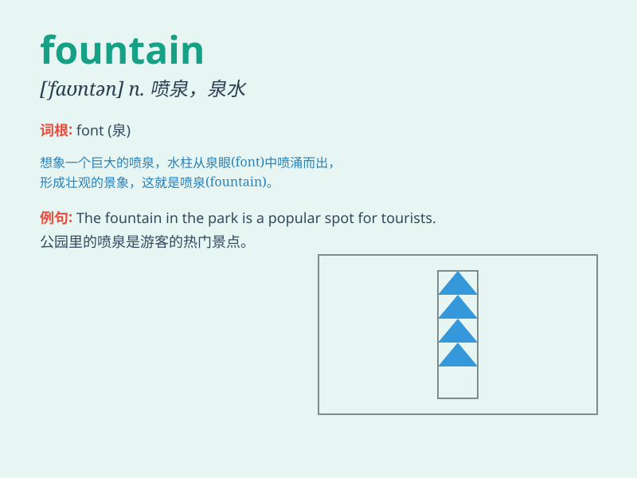

## fountain

**英音:** _[ˈfaʊntən]_ **美音:** _[\'faʊntn]_

**译义:** *n.泉水,喷泉,源泉*

### 短语

+ **drinking fountain:** _（设于公共场所的）自动饮水器_

+ **fountain pen:** _钢笔_

+ **soda fountain:** _冷饮柜；冷饮小卖部_

+ **fountain of wisdom:** _智慧的源泉_

+ **fountain of youth:** _青春之泉（传说能使人恢复青春的泉水）_

### 例句

#### 例句1

> **The fountain in the park is very beautiful.**

**中文翻译:** 公园里的喷泉非常漂亮。

**单词释义:** 喷泉

#### 例句2

> **She drank from the fountain of wisdom.**

**中文翻译:** 她畅饮了智慧的泉水。

**单词释义:** 源泉；根源

#### 例句3

> **The pen is a fountain of ideas for him.**

**中文翻译:** 对他来说，钢笔是思想的源泉。

**单词释义:** 源泉

### 背诵小故事

> One day, I was lost in a big park. Suddenly, I saw a beautiful
fountain. The water was spraying high up in the air like a magical
dance. It was so charming that I\'ll never forget it.

**有一天，我在一个大公园里迷路了。突然，我看到了一个漂亮的喷泉。水高高地喷向空中，就像一场神奇的舞蹈。它太迷人了，让我永远难以忘怀。**

### 图义

