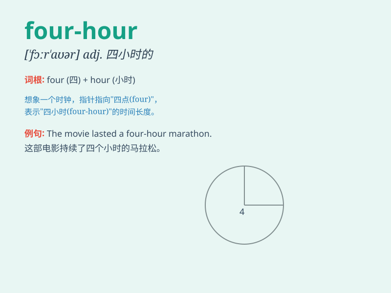

## four-hour

**英音:** _[fɔːr ˈaʊə]_ **美音:** _[fɔr ˈaʊər]_

**译义:** *adj. 持续四小时的；四小时长的*

### 短语

+ **four-hour journey:** _四小时的旅程_

+ **four-hour meeting:** _四小时的会议_

+ **four-hour delay:** _四小时的延误_

+ **four-hour work:** _四小时的工作_

+ **four-hour rest:** _四小时的休息_

### 例句

#### 例句1

> **The four-hour meeting was very productive.**

**中文翻译:** 这个四小时的会议非常有成效。

**单词释义:** 四小时的（用于修饰名词 meeting，表示会议的时长）

#### 例句2

> **They completed the four-hour journey safely.**

**中文翻译:** 他们安全地完成了这四小时的旅程。

**单词释义:** 四小时的（修饰名词 journey，指旅程的时长）

#### 例句3

> **The four-hour exam tested the students\' knowledge
thoroughly.**

**中文翻译:** 这场四小时的考试全面地测试了学生们的知识。

**单词释义:** 四小时的（形容 exam，表明考试持续的时间）

### 背诵小故事

> Imagine a long race. It lasts for four hours. Everyone is tired but
keeps going. \'Four-hour\' here describes the duration of this
challenging race. It\'s like a long journey that takes exactly four
hours to complete.

**想象一场长跑比赛。它持续了四个小时。每个人都很累但仍在坚持。\'four-hour\'在这里描述了这场具有挑战性的比赛的持续时间。它就像一段正好需要四个小时才能完成的漫长旅程。**

### 图义

