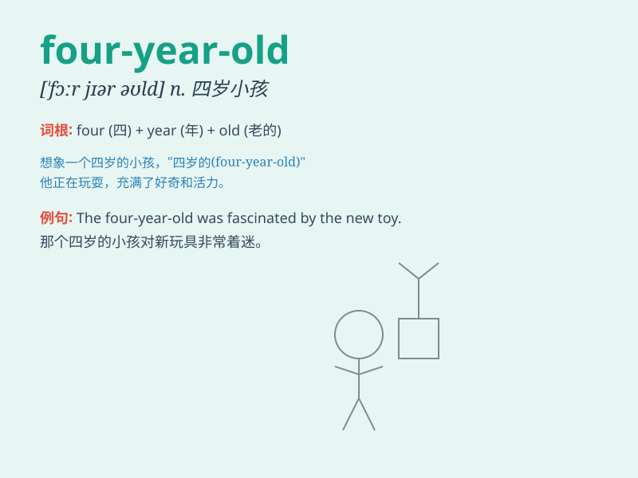

## four-year-old

**英音:** _[fɔːr jɪər əʊld]_ **美音:** _[fɔr jɪr oʊld]_

**译义:** *adj. 四岁的；n. 四岁的人或动物*

### 短语

+ **a four-year-old boy:** _一个四岁的男孩_

+ **four-year-old children:** _四岁的孩子们_

+ **a four-year-old girl:** _一个四岁的女孩_

+ **four-year-old twins:** _四岁的双胞胎_

+ **the four-year-old class:** _四岁的班级_

### 例句

#### 例句1

> **The four-year-old boy is very cute.**

**中文翻译:** 这个四岁的男孩非常可爱。

**单词释义:** 四岁的

#### 例句2

> **My sister has a four-year-old daughter.**

**中文翻译:** 我姐姐有一个四岁的女儿。

**单词释义:** 四岁的

#### 例句3

> **The four-year-old child can sing many songs.**

**中文翻译:** 这个四岁的孩子会唱很多歌。

**单词释义:** 四岁的

### 背诵小故事

> There was a four-year-old boy. One day, he saw a colorful kite and
wanted to play with it. But he was too small to reach it. His mom helped
him and he was very happy.

**有一个四岁的小男孩。一天，他看到一只五颜六色的风筝，想要玩它。但他太小够不着。他妈妈帮助了他，他非常开心。**

### 图义

