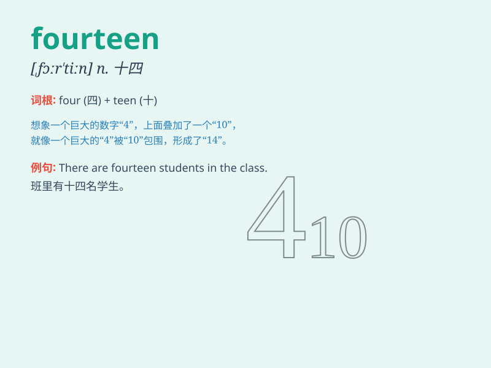

## fourteen

**英音:** _[fɔː\'tiːn; \'fɔːtiːn]_ **美音:**
_[,fɔr\'tin]_

**译义:** * num.十四*

### 短语

+ **fourteen years old:** _十四岁_

+ **at fourteen:** _在十四岁时_

+ **fourteen days:** _十四天_

+ **fourteen people:** _十四个人_

+ **fourteen times:** _十四次_

### 例句

#### 例句1

> **I am fourteen years old.**

**中文翻译:** 我今年十四岁。

**单词释义:** 十四

#### 例句2

> **There are fourteen apples on the table.**

**中文翻译:** 桌子上有十四个苹果。

**单词释义:** 十四

#### 例句3

> **She started learning English at fourteen.**

**中文翻译:** 她十四岁开始学习英语。

**单词释义:** 十四

### 背诵小故事

> One day, a little girl was celebrating her fourteenth birthday. She
had fourteen candles on her cake and received fourteen gifts. It was a
wonderful day for her to remember being fourteen.

**一天，一个小女孩正在庆祝她的十四岁生日。她的蛋糕上有十四根蜡烛，并且收到了十四份礼物。对她来说，这是记住自己十四岁的美好一天。**

### 图义

