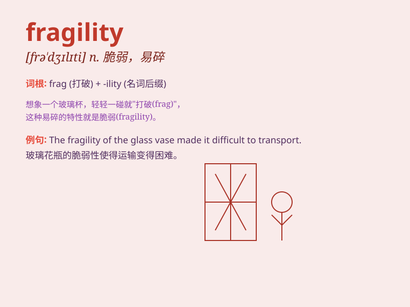

## fragility

**英音:** _[frə\'dʒɪlɪtɪ]_ **美音:** _[frə\'dʒɪləti]_

**译义:** *n.脆弱,虚弱*

### 短语

+ **structural fragility:** _结构脆弱性_

+ **emotional fragility:** _情感脆弱_

+ **economic fragility:** _经济脆弱性_

+ **fragility of the ecosystem:** _生态系统的脆弱性_

+ **psychological fragility:** _心理脆弱_

### 例句

#### 例句1

> **The fragility of the glass made it easy to break.**

**中文翻译:** 玻璃的脆性使其很容易破碎。

**单词释义:** 脆弱；易碎性

#### 例句2

> **She was aware of the fragility of their relationship.**

**中文翻译:** 她意识到他们关系的脆弱。

**单词释义:** 脆弱；不稳固

#### 例句3

> **The fragility of the ecosystem is a cause for concern.**

**中文翻译:** 生态系统的脆弱性令人担忧。

**单词释义:** 脆弱；易损性

### 背诵小故事

> Once upon a time, there was a beautiful vase. But it had fragility.
One day, it was accidentally knocked over and broke into pieces. This
showed how easily it could be damaged.

**从前，有一个漂亮的花瓶。但它具有脆弱性。有一天，它不小心被撞倒并碎成了片。这表明它是多么容易被损坏。**

### 图义

