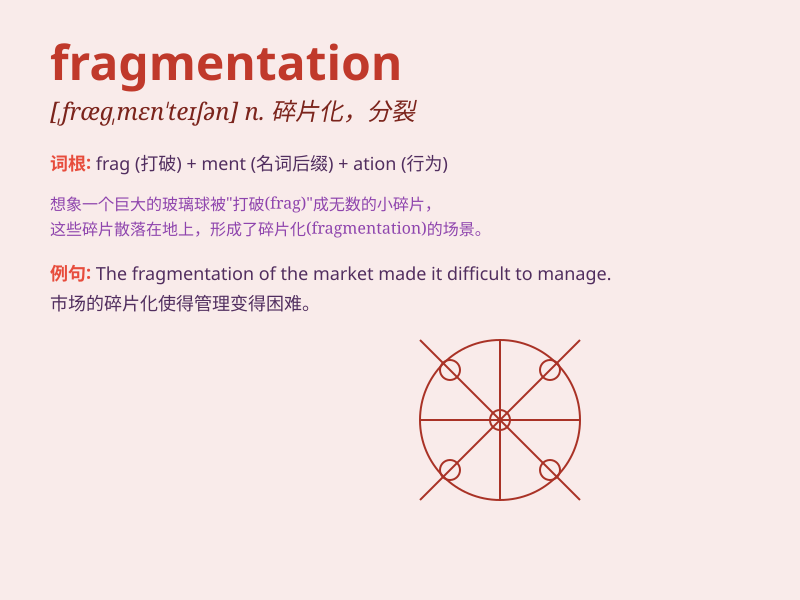

## fragmentation

**英音:** _[frægmen\'teɪʃ(ə)n]_ **美音:**
_[,frægmən\'teʃən]_

**译义:** *n.分裂,破碎*

### 短语

+ **fragmentation bomb:** _碎片炸弹_

+ **data fragmentation:** _数据分段_

+ **market fragmentation:** _市场细分_

+ **memory fragmentation:** _内存碎片_

+ **fragmentation process:** _破碎过程_

### 例句

#### 例句1

> **The fragmentation of the company led to its decline.**

**中文翻译:** 公司的分裂导致了公司的衰落。

**单词释义:** 分裂；破碎

#### 例句2

> **The fragmentation of the rock was caused by the explosion.**

**中文翻译:** 岩石碎裂是爆炸造成的。

**单词释义:** 破碎；碎裂

#### 例句3

> **The fragmentation of the market makes it difficult for small
businesses to compete.**

**中文翻译:** 市场的分散使得小企业难以竞争。

**单词释义:** 碎片化；分裂

### 背诵小故事

> Imagine a beautiful vase falling to the ground and breaking into many
small pieces. This process of the vase breaking into numerous fragments
is called \'fragmentation\'.

**想象一个美丽的花瓶掉到地上并碎成许多小块。花瓶碎成众多碎片的这个过程就叫做'fragmentation'（分裂；破碎）。**

### 图义

