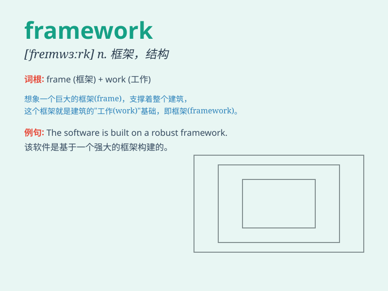

## framework

**英音:** _[\'freɪmwɜːk]_ **美音:** _[\'fremwɝk]_

**译义:** *n.构架,框架,结构*

### 短语

+ **conceptual framework:** _概念框架_

+ **legal framework:** _法律框架_

+ **framework agreement:** _框架协议_

+ **analytical framework:** _分析框架_

+ **theoretical framework:** _理论框架_

### 例句

#### 例句1

> **The framework of the building needs to be strengthened.**

**中文翻译:** 建筑物的框架需要加强。

**单词释义:** 框架；结构

#### 例句2

> **We need to establish a legal framework to deal with this
issue.**

**中文翻译:** 我们需要建立一个法律框架来处理这个问题。

**单词释义:** 框架；体系

#### 例句3

> **The framework of the essay is clear and logical.**

**中文翻译:** 文章的框架清晰、逻辑性强。

**单词释义:** 框架；架构

### 背诵小故事

>
想象一个建筑工人正在搭建房屋框架（framework），他先立起坚固的柱子，然后在柱子之间铺设横梁，逐步形成一个稳定的结构，就像我们学习知识需要一个坚实的框架一样。

**想象一位建筑工人搭建房屋框架的情景，以助理解单词\'framework\'，就像学习知识需要稳固框架一样。**

### 图义

