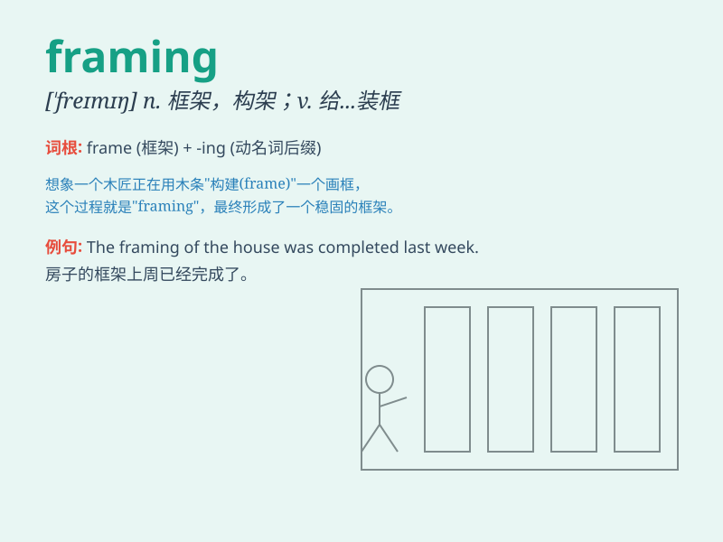

## framing

**英音:** _[\'freɪmɪŋ]_ **美音:** _[\'fremɪŋ]_

**译义:** *v.取景*

### 短语

+ **framing effect:** _框架效应_

+ **framing camera:** _取景照相机_

+ **framing nail:** _框钉_

+ **framing member:** _构架构件_

+ **framing plan:** _框架平面图_

### 例句

#### 例句1

> **The framing of the picture is very elegant.**

**中文翻译:** 画面的构图非常优雅。

**单词释义:** 框子；框架

#### 例句2

> **His speech was all about the framing of the issue.**

**中文翻译:** 他的讲话都是关于问题的框架。

**单词释义:** 阐述；表达

#### 例句3

> **The framing of the law needs to be reconsidered.**

**中文翻译:** 法律的框架需要重新考虑。

**单词释义:** 制定；构成

### 背诵小故事

> A thief was caught while framing an innocent person for the crime.
The police saw through his framing plan and arrested him. Remember,
\'framing\' means to make a false case against someone.

**一个小偷在诬陷一个无辜的人犯罪时被抓住了。警察识破了他的诬陷计划并逮捕了他。记住，\'framing\'意思是诬陷某人。**

### 图义

