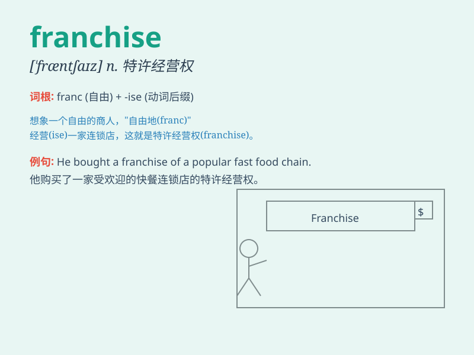

## franchise

**英音:** _[\'fræn(t)ʃaɪz]_ **美音:** _[\'fræntʃaɪz]_

**译义:** *n.特权,公民权v.赋予特权,赋予公民权*

### 短语

+ **franchise agreement:** _特许经营协议_

+ **franchise business:** _特许经营业务_

+ **franchise fee:** _特许经营费_

+ **franchise owner:** _特许经营业主_

+ **franchise system:** _特许经营体系_

### 例句

#### 例句1

> **The fast-food chain has franchises all over the country.**

**中文翻译:** 这家快餐连锁店在全国各地都有特许经营店。

**单词释义:** 特许经营权

#### 例句2

> **She was granted a franchise to operate the store.**

**中文翻译:** 她获得了经营这家商店的特许经营权。

**单词释义:** 特许权

#### 例句3

> **The sports franchise is very popular among fans.**

**中文翻译:** 该体育专营权深受球迷欢迎。

**单词释义:** 特许经营项目

### 背诵小故事

> A young entrepreneur dreamed of having a franchise. He worked hard,
got the right license, and finally opened a popular coffee shop. The
franchise gave him the brand\'s support and a successful business.

**一位年轻的企业家梦想拥有一家特许经营店。他努力工作，获得了正确的许可证，最终开了一家受欢迎的咖啡店。特许经营权给了他品牌的支持和成功的生意。**

### 图义

