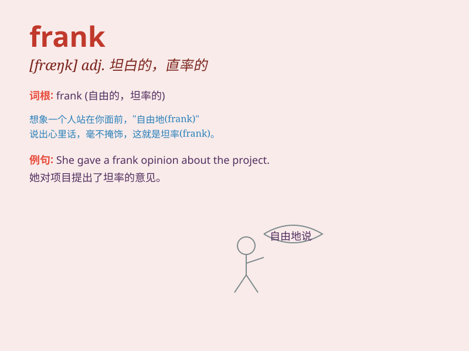

## frank

**英音:** _[fræŋk]_ **美音:** _[fræŋk]_

**译义:** *adj.坦白的,率直的,老实的vt.免费邮寄n.免费邮寄特权 Frank
弗兰克(男子名)*

### 短语

+ **frank discussion:** _坦率的讨论_

+ **frank opinion:** _坦诚的意见_

+ **be frank with:** _对\...\...坦诚_

+ **frank statement:** _坦率的陈述_

+ **frank manner:** _坦率的态度_

### 例句

#### 例句1

> **To be frank, I don\'t like this movie.**

**中文翻译:** 坦白说，我不喜欢这部电影。

**单词释义:** 坦白的；直率的

#### 例句2

> **She gave me a frank look.**

**中文翻译:** 她坦白地看了我一眼。

**单词释义:** 坦率的

#### 例句3

> **A frank discussion can help solve the problem.**

**中文翻译:** 坦诚的讨论有助于解决问题。

**单词释义:** 坦率的

### 背诵小故事

>
有一只叫弗兰克（Frank）的小狗，它总是真诚坦率地表达自己的喜怒哀乐。比如它饿了就汪汪叫，开心就摇尾巴，从不掩饰。人们都喜欢它的坦率，因为它总是那么真实。

**有一只叫弗兰克的小狗，它总是真诚坦率地表达情绪，人们喜欢它的真实，以此记住单词frank（坦率的；直率的）**

### 图义

