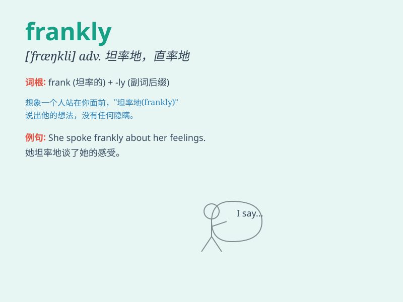

## frankly

**英音:** _[\'fræŋklɪ]_ **美音:** _[\'fræŋkli]_

**译义:** *adv.坦白地,真诚地*

### 短语

+ **frankly speaking:** _坦白地说；坦率地讲_

+ **tell frankly:** _坦率地告知_

+ **answer frankly:** _坦率地回答_

+ **write frankly:** _坦率地书写_

+ **express frankly:** _坦率地表达_

### 例句

#### 例句1

> **Frankly, I don\'t think you\'re right.**

**中文翻译:** 坦白说，我不认为你是对的。

**单词释义:** 坦率地

#### 例句2

> **Frankly speaking, I\'m not satisfied with your performance.**

**中文翻译:** 坦白说，我对你的表现并不满意。

**单词释义:** 坦率地

#### 例句3

> **She answered frankly when asked about her past.**

**中文翻译:** 当被问及她的过去时，她坦诚地回答。

**单词释义:** 坦率地

### 背诵小故事

> One day, a little boy was asked if he broke the vase. Frankly, he
admitted it was him. His honesty made everyone happy. Remember,
\'frankly\' means to be honest and straightforward.

**有一天，一个小男孩被问到是不是他打碎了花瓶。坦率地，他承认是他。他的诚实让大家都很高兴。记住，\'frankly\'意思是坦率地，诚实地。**

### 图义

