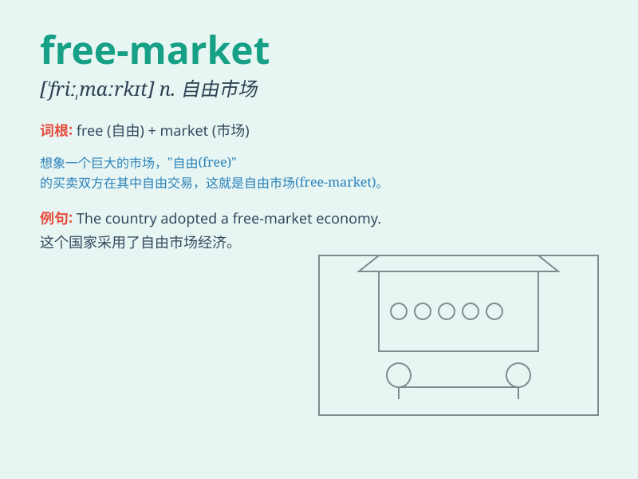

## free-market

**英音:** _[ˈfriːˈmɑːkɪt]_ **美音:** _[ˈfriːˈmɑːrkɪt]_

**译义:** *自由市场的，指不受政府干预的市场经济体系*

### 短语

+ **free-market economy:** _自由市场经济_

+ **free-market system:** _自由市场体系_

+ **free-market competition:** _自由市场竞争_

+ **free-market forces:** _自由市场力量_

+ **free-market policy:** _自由市场政策_

### 例句

#### 例句1

> **The country has adopted a free-market economic system to promote
growth.**

**中文翻译:** 这个国家采用了自由市场经济体制来促进增长。

**单词释义:** 自由市场的

#### 例句2

> **Free-market competition often leads to lower prices and better
quality products.**

**中文翻译:** 自由市场竞争通常会导致价格降低和产品质量提高。

**单词释义:** 自由市场的

#### 例句3

> **We need to create a more favorable environment for free-market
development.**

**中文翻译:** 我们需要为自由市场的发展创造更有利的环境。

**单词释义:** 自由市场的

### 背诵小故事

> In a small town, a brave entrepreneur started a business in a
free-market environment. He could choose what to sell and how to price
without too many restrictions. This freedom led to his success and the
town\'s prosperity.

**在一个小镇上，一位勇敢的企业家在自由市场的环境中创业。他可以自由选择卖什么以及如何定价，没有太多限制。这种自由带来了他的成功和小镇的繁荣。**

### 图义

