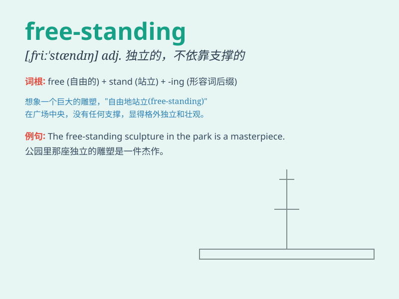

## free-standing

**英音:** _[ˌfriː ˈstændɪŋ]_ **美音:** _[ˌfriː
ˈstændɪŋ]_

**译义:** *adj.独立式的；自立的；不依靠支撑物的*

### 短语

+ **free-standing building:** _独立式建筑物_

+ **free-standing oven:** _独立式烤箱_

+ **free-standing bookshelf:** _独立式书架_

+ **free-standing structure:** _独立式结构_

+ **free-standing cabinet:** _独立式橱柜_

### 例句

#### 例句1

> **The free-standing sculpture was the centerpiece of the art
exhibition.**

**中文翻译:** 这座独立式雕塑是艺术展览的核心展品。

**单词释义:** 独立式的

#### 例句2

> **The free-standing bookshelf can be placed anywhere in the
room.**

**中文翻译:** 这个独立式书架可以放在房间的任何地方。

**单词释义:** 独立式的

#### 例句3

> **We need a free-standing wardrobe for more storage space.**

**中文翻译:** 我们需要一个独立式衣柜来获得更多的存储空间。

**单词释义:** 独立式的

### 背诵小故事

> Imagine a big library. There is a bookshelf that is not attached to
anything. It stands freely on its own. This bookshelf is free-standing.
It means not fixed or supported by anything else.

**想象一个大图书馆。有一个书架不依附于任何东西。它独自自由地站立着。这个书架就是独立式的。意思是不固定或不被其他东西支撑。**

### 图义

