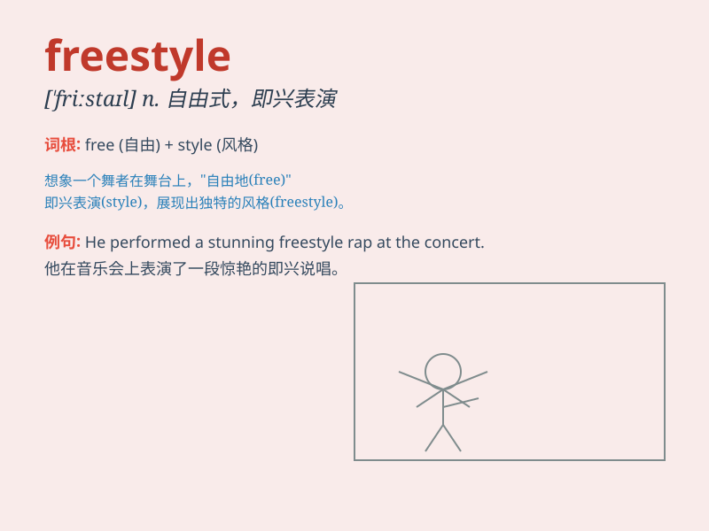

## freestyle

**英音:** _[\'friːstaɪl]_ **美音:** _[\'fristaɪl]_

**译义:** *n.自由式*

### 短语

+ **freestyle swimming:** _自由泳_

+ **freestyle skiing:** _自由式滑雪_

+ **freestyle rap:** _即兴说唱_

+ **freestyle wrestling:** _自由式摔跤_

+ **do freestyle:** _进行自由式表演_

### 例句

#### 例句1

> **He is really good at freestyle swimming.**

**中文翻译:** 他非常擅长自由泳。

**单词释义:** 自由式的（指游泳）

#### 例句2

> **The rapper delivered an amazing freestyle performance.**

**中文翻译:** 这位说唱歌手带来了一场令人惊叹的即兴说唱表演。

**单词释义:** 即兴的（指表演）

#### 例句3

> **She loves to dance freestyle in her room.**

**中文翻译:** 她喜欢在自己房间里自由式跳舞。

**单词释义:** 自由式的（指舞蹈）

### 背诵小故事

> One day, a young dancer was on the stage. The music started and he
decided to freestyle. He moved freely, expressing his unique feelings
and creativity, and the audience was amazed by his impromptu
performance.

**有一天，一位年轻的舞者站在舞台上。音乐响起，他决定自由式表演。他自由地舞动，展现出独特的情感和创造力，观众被他的即兴表演所惊艳。**

### 图义

