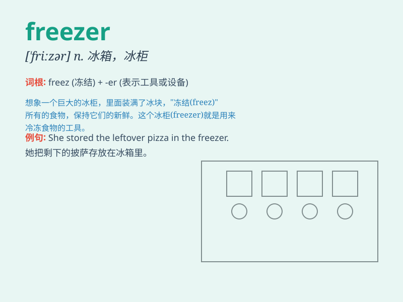

## freezer

**英音:** _[\'friːzə]_ **美音:** _[\'frizɚ]_

**译义:** *n.制冰淇淋者,冷藏工人*

### 短语

+ **chest freezer:** _卧式冰柜_

+ **upright freezer:** _立式冰柜_

+ **deep freezer:** _深冷冰柜；低温冰箱_

+ **freezer compartment:** _冷冻室_

+ **home freezer:** _家用冰柜_

### 例句

#### 例句1

> **I put the ice cream in the freezer to keep it from melting.**

**中文翻译:** 我把冰淇淋放进冷冻室以免它融化。

**单词释义:** 冷冻室；冰柜

#### 例句2

> **The fish was stored in the freezer until we were ready to cook
it.**

**中文翻译:** 鱼被存放在冷冻柜里，直到我们准备烹饪它。

**单词释义:** 冷冻柜

#### 例句3

> **The freezer is full of frozen food.**

**中文翻译:** 冷冻室里装满了冷冻食品。

**单词释义:** 冷冻室

### 背诵小故事

> One day, I opened the freezer to get some ice cream. But it was so
cold inside! I quickly took what I needed and closed the door. The
freezer keeps food frozen and fresh.

**有一天，我打开冰箱去拿冰淇淋。但里面太冷了！我迅速拿了我需要的东西然后关上了门。冰箱能让食物冷冻保鲜。**

### 图义

