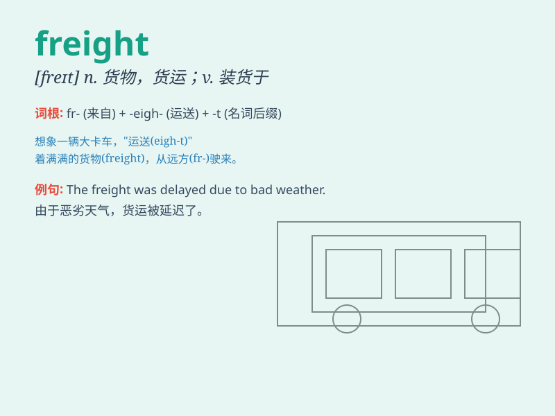

## freight

**英音:** _[freɪt]_ **美音:** _[fret]_

**译义:** *n.货物,船货,运费,货运vt.装货,使充满,运送*

### 短语

+ **freight train:** _货运列车_

+ **freight forwarder:** _货运代理_

+ **freight charge:** _运费_

+ **freight rate:** _运费率_

+ **freight transport:** _货物运输_

### 例句

#### 例句1

> **The freight train was carrying a load of coal.**

**中文翻译:** 这列货运火车正在运载一批煤炭。

**单词释义:** 货物；货运

#### 例句2

> **The cost of freight has increased significantly this year.**

**中文翻译:** 今年货运成本大幅增加。

**单词释义:** 货运；运费

#### 例句3

> **They freighted the goods by ship.**

**中文翻译:** 他们用船运输货物。

**单词释义:** 运输（货物）

### 背诵小故事

> A truck was fully loaded with goods. The driver knew these goods,
called freight, had to be delivered safely and on time. The weight of
the freight made the truck move slowly but steadily towards its
destination.

**一辆卡车装满了货物。司机知道这些被称为"freight（货物；货运）"的东西必须安全、按时送达。货物的重量使卡车移动缓慢但平稳地驶向目的地。**

### 图义

