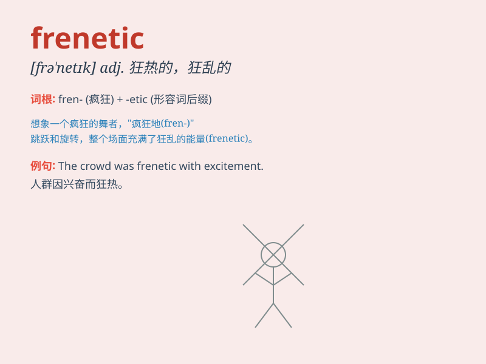

## frenetic

**英音:** _[frə\'netɪk]_ **美音:** _[frə\'nɛtɪk]_

**译义:** *adj.发狂的,狂热的n.发狂者*

### 短语

+ **frenetic activity:** _狂热的活动_

+ **frenetic pace:** _疯狂的节奏_

+ **frenetic energy:** _狂热的能量_

+ **frenetic search:** _疯狂的搜索_

+ **frenetic behavior:** _狂乱的行为_

### 例句

#### 例句1

> **The office was in a frenetic state as the deadline
approached.**

**中文翻译:** 随着截止日期的临近，办公室处于一种狂热的状态。

**单词释义:** 狂热的；发狂的

#### 例句2

> **She led a frenetic social life, constantly going to parties.**

**中文翻译:** 她过着狂热的社交生活，不断地参加聚会。

**单词释义:** 疯狂的；极度活跃的

#### 例句3

> **The frenetic pace of the city was exhausting.**

**中文翻译:** 这个城市疯狂的节奏让人筋疲力尽。

**单词释义:** 疯狂的；忙乱的

### 背诵小故事

> A crazy scientist was working in his lab with frenetic energy. He was
running around, mixing chemicals, and making wild notes. His frenetic
behavior made everyone worried.

**一位疯狂的科学家在他的实验室里精力极度亢奋地工作着。他到处跑，混合化学药品，疯狂地做笔记。他这种极度亢奋的行为让每个人都很担心。**

### 图义

