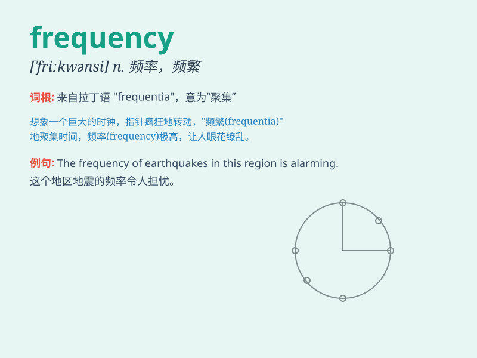

## frequency

**英音:** _[\'friːkw(ə)nsɪ]_ **美音:** _[\'frikwənsi]_

**译义:** *n.频率,周率,发生次数*

### 短语

+ **frequency response:** _频率响应_

+ **high frequency:** _高频；高频率_

+ **low frequency:** _低频；低频率_

+ **frequency band:** _频带；频段_

+ **frequency spectrum:** _频谱；频率谱_

### 例句

#### 例句1

> **The frequency of earthquakes in this area is relatively high.**

**中文翻译:** 这个地区地震的频率相对较高。

**单词释义:** （某事发生的）频率

#### 例句2

> **The radio station broadcasts at various frequencies.**

**中文翻译:** 这家电台以各种频率进行广播。

**单词释义:** 频率

#### 例句3

> **We need to analyze the frequency of customer complaints.**

**中文翻译:** 我们需要分析客户投诉的频率。

**单词释义:** （某事发生的）频率

### 背诵小故事

> A scientist was studying sound waves. He found that the number of
times a wave repeated in a certain period was the \'frequency\'. The
higher the frequency, the higher the pitch. So, \'frequency\' is how
often something happens or repeats.

**一位科学家正在研究声波。他发现波在一定时期内重复的次数就是"频率"。频率越高，音高越高。所以，"frequency"就是某事发生或重复的频繁程度。**

### 图义

