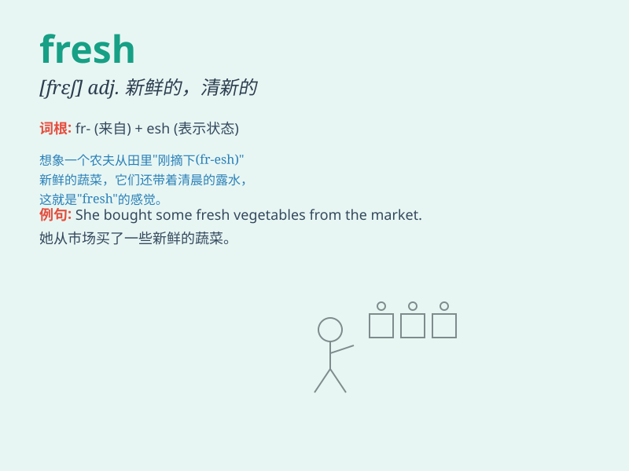

## fresh

**英音:** _[freʃ]_ **美音:** _[frɛʃ]_

**译义:**
*adj.新鲜的,无经验的,生的,冒失的,鲜艳的adv.最新地,刚刚n.开始,泛滥*

### 短语

+ **fresh air:** _新鲜空气_

+ **fresh water:** _淡水；新鲜的水_

+ **fresh fruit:** _新鲜水果_

+ **fresh start:** _新的开始；全新起点_

+ **fresh flowers:** _鲜花；新鲜的花_

### 例句

#### 例句1

> **The air in the mountains is so fresh.**

**中文翻译:** 山里的空气非常清新。

**单词释义:** 清新的

#### 例句2

> **I need to buy some fresh vegetables for dinner.**

**中文翻译:** 我需要买一些新鲜的蔬菜做晚餐。

**单词释义:** 新鲜的

#### 例句3

> **She has a fresh perspective on this problem.**

**中文翻译:** 她对这个问题有新颖的看法。

**单词释义:** 新颖的

### 背诵小故事

> A traveler was lost in the desert. Feeling exhausted, he finally
found a fresh spring. The clear water made him regain strength. Fresh
means new, clean and full of vitality.

**一位旅行者在沙漠中迷路了。感到精疲力竭时，他终于找到了一处清泉。清澈的水让他重新恢复了力气。fresh
意思是新的、干净的、充满活力的。**

### 图义

