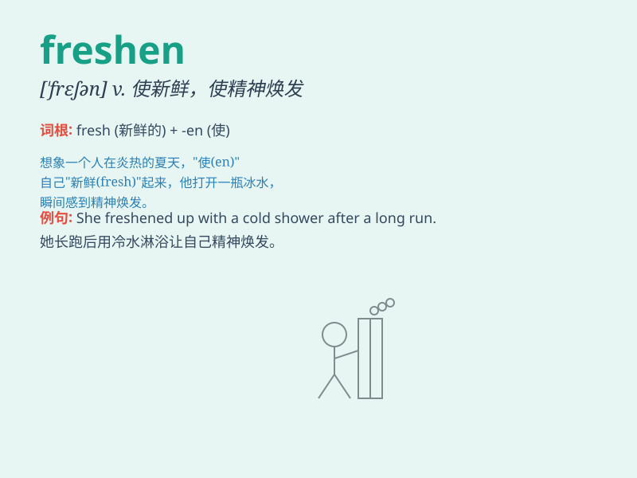

## freshen

**英音:** _[\'freʃ(ə)n]_ **美音:** _[\'frɛʃən]_

**译义:** *v.(使)显得新鲜,(使)精神饱满,(使)减少咸味*

### 短语

+ **freshen up:** _梳洗一番；使精神饱满_

+ **freshen the air:** _使空气清新_

+ **freshen one\'s drink:** _给某人的饮料续杯_

+ **freshen the flowers:** _给花保鲜_

+ **freshen the paint:** _使油漆变新_

### 例句

#### 例句1

> **The sea breeze freshened the air in the room.**

**中文翻译:** 海风使房间里的空气变得清新。

**单词释义:** 使清新

#### 例句2

> **She freshened up her makeup before the party.**

**中文翻译:** 她在聚会前重新化了妆。

**单词释义:** 使焕然一新

#### 例句3

> **The rain freshened the grass and flowers.**

**中文翻译:** 雨水使草和花恢复生机。

**单词释义:** 使新鲜

### 背诵小故事

> One hot summer day, my room was stuffy. I opened the window to let in
some fresh air and it freshened up the space. Just like that, everything
felt cooler and more pleasant.

**在一个炎热的夏日，我的房间很闷热。我打开窗户让新鲜空气进来，这让房间清新了起来。就像这样，一切都感觉更凉爽、更宜人了。**

### 图义

