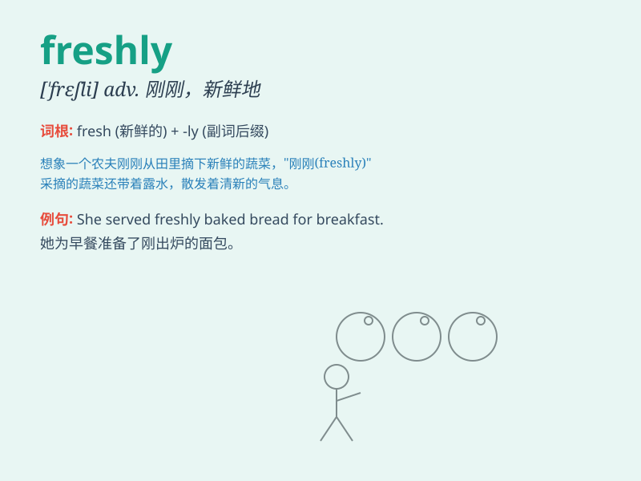

## freshly

**英音:** _[ˈfreʃli]_ **美音:** _[ˈfreʃli]_

**译义:** *adv.气味清新地,精神饱满地,刚才*

### 短语

+ **freshly baked:** _新烤的_

+ **freshly cut:** _新切的_

+ **freshly painted:** _新刷漆的_

+ **freshly picked:** _新采摘的_

+ **freshly washed:** _新洗的_

### 例句

#### 例句1

> **The bread was freshly baked and smelled wonderful.**

**中文翻译:** 面包是新烤的，闻起来很香。

**单词释义:** 新；刚刚

#### 例句2

> **She wore a dress made of freshly picked flowers.**

**中文翻译:** 她穿着一件用刚摘的花做成的裙子。

**单词释义:** 刚；刚刚

#### 例句3

> **The room was decorated with freshly cut branches.**

**中文翻译:** 房间用刚砍下的树枝装饰着。

**单词释义:** 刚；刚刚

### 背诵小故事

> A chef freshly picked some vegetables from the garden and cooked a
delicious meal. The smell of the freshly cooked food filled the kitchen.
It means newly or recently.

**一位厨师刚从菜园里采摘了一些蔬菜，做了一顿美味的饭菜。刚做好的饭菜的香味弥漫了整个厨房。这个单词意思是新地；刚刚；最近地**

### 图义

