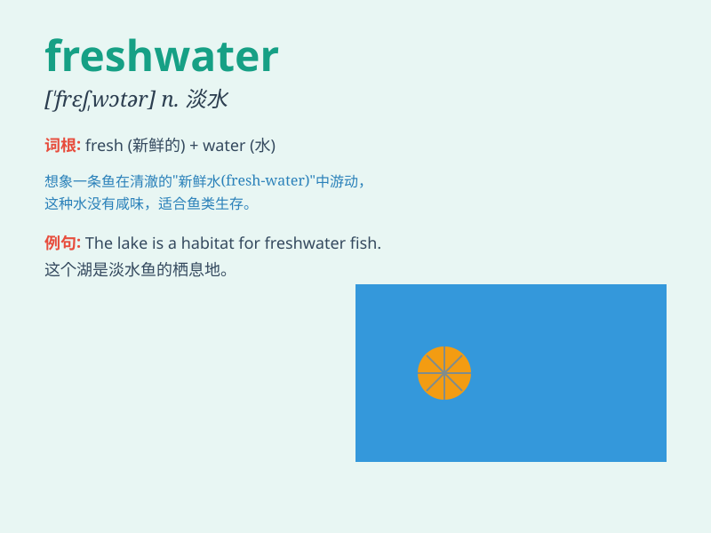

## freshwater

**英音:** _[\'freʃwɔːtə]_ **美音:** _[\'frɛʃwɔtɚ]_

**译义:** *n.淡水(不是海洋水的),湖水,内河*

### 短语

+ **freshwater fish:** _淡水鱼_

+ **freshwater lake:** _淡水湖_

+ **freshwater pearl:** _淡水珍珠_

+ **freshwater ecosystem:** _淡水生态系统_

+ **freshwater resources:** _淡水资源_

### 例句

#### 例句1

> **The lake is a large expanse of freshwater.**

**中文翻译:** 这个湖是一大片淡水水域。

**单词释义:** 淡水的

#### 例句2

> **Freshwater fish are different from saltwater fish.**

**中文翻译:** 淡水鱼和咸水鱼不同。

**单词释义:** 淡水的

#### 例句3

> **We need to protect our freshwater resources.**

**中文翻译:** 我们需要保护我们的淡水资源。

**单词释义:** 淡水的

### 背诵小故事

> One day, a little fish was lost in the big ocean. It swam and swam
until it found a special place with freshwater. The water was clean and
sweet, making the little fish very happy. Freshwater was its safe haven.

**有一天，一条小鱼在大海里迷路了。它游啊游，直到发现了一个特别的地方，那里有淡水。水干净又清甜，让小鱼非常开心。淡水就是它的安全港湾。**

### 图义

