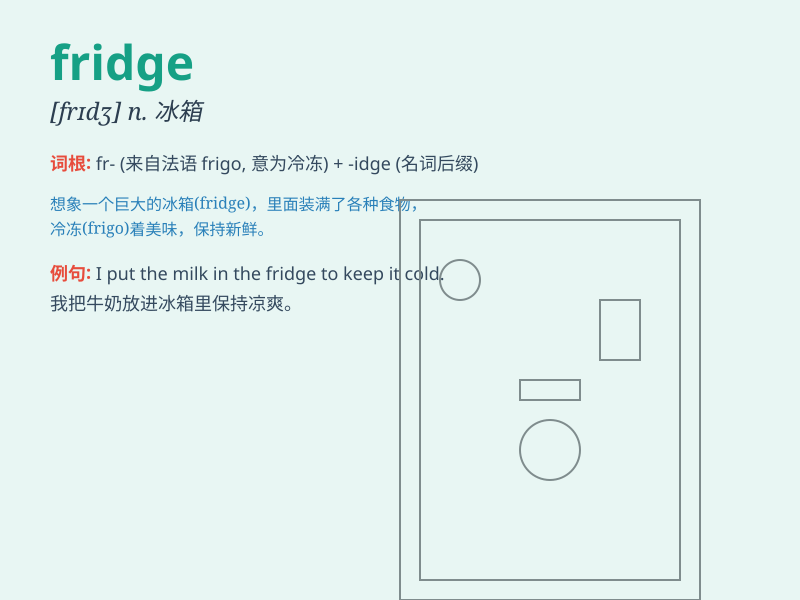

## fridge

**英音:** _[frɪdʒ]_ **美音:** _[frɪdʒ]_

**译义:** *n.电冰箱*

### 短语

+ **fridge magnet:** _冰箱贴_

+ **fridge door:** _冰箱门_

+ **fridge freezer:** _冰箱冷冻室_

+ **compact fridge:** _小型冰箱_

+ **double-door fridge:** _双门冰箱_

### 例句

#### 例句1

> **I put the milk in the fridge.**

**中文翻译:** 我把牛奶放进了冰箱。

**单词释义:** 冰箱

#### 例句2

> **The fridge is empty. We need to go shopping.**

**中文翻译:** 冰箱是空的。我们需要去购物。

**单词释义:** 冰箱

#### 例句3

> **There is some ice cream in the fridge.**

**中文翻译:** 冰箱里有一些冰淇淋。

**单词释义:** 冰箱

### 背诵小故事

> One day, I was very thirsty and opened the fridge to find a cold
drink. But the fridge was almost empty! I had to go shopping to fill it
up. Remember, fridge is where we keep food and drinks cool.

**有一天，我非常口渴，打开冰箱找冷饮。但冰箱几乎是空的！我不得不去购物把它填满。记住，fridge
就是我们存放食物和饮料使其保持凉爽的地方。**

### 图义

