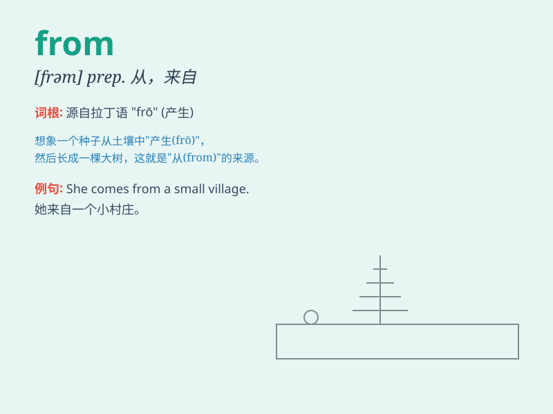

## from

**英音:** _[frɒm; frəm]_ **美音:** _[frʌm]_

**译义:** * prep.从,今后,来自,由于*

### 短语

+ **from now on:** _从现在开始_

+ **from time to time:** _不时，有时_

+ **be different from:** _与\...\...不同_

+ **far from:** _远离；远非_

+ **from door to door:** _挨家挨户_

### 例句

#### 例句1

> **I\'m from China.**

**中文翻译:** 我来自中国。

**单词释义:** 来自

#### 例句2

> **The letter is from my friend.**

**中文翻译:** 这封信来自我的朋友。

**单词释义:** 来自

#### 例句3

> **She learned a lot from her mistakes.**

**中文翻译:** 她从自己的错误中学到了很多。

**单词释义:** 从\...\...

### 背诵小故事

> 想象有一只小松鼠，它总是从一棵大树的树洞 FROM
中跑出来找食物。每次它出现，我们就知道它是 FROM
那个特别的树洞。这样我们就记住 from 有'从......'的意思啦。

**想象一只小松鼠总是从大树的树洞中跑出来，从而记住 from
表示'从......'的意思。**

### 图义

