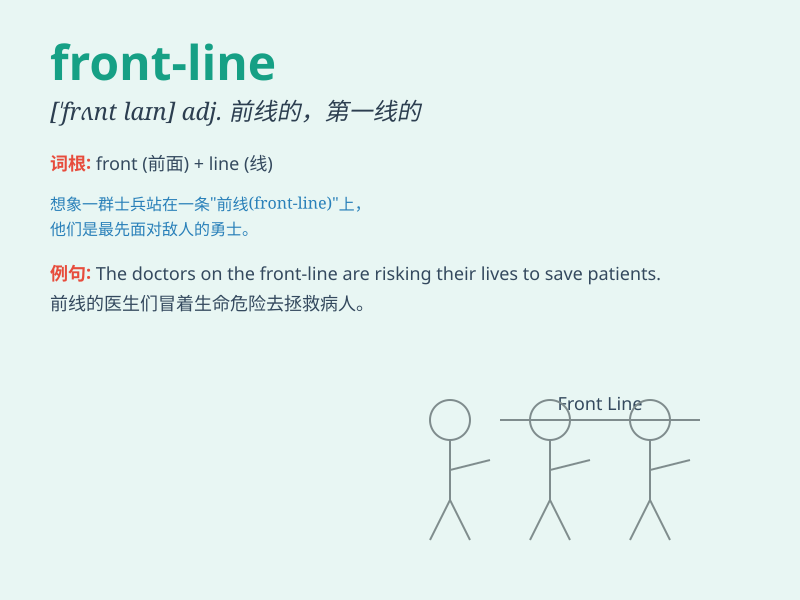

## front-line

**英音:** _[ˌfrʌnt ˈlaɪn]_ **美音:** _[ˌfrʌnt ˈlaɪn]_

**译义:** *n.前线；第一线；锋线*

### 短语

+ **front-line troops:** _前线部队_

+ **front-line workers:** _一线工人_

+ **front-line position:** _前沿阵地；前线岗位_

+ **front-line services:** _一线服务_

+ **front-line staff:** _一线员工_

### 例句

#### 例句1

> **The doctor was on the front-line fighting against the
epidemic.**

**中文翻译:** 这位医生在抗疫前线奋战。

**单词释义:** 前线；第一线

#### 例句2

> **The soldiers on the front-line showed great courage.**

**中文翻译:** 前线的士兵们表现出了巨大的勇气。

**单词释义:** 前线；第一线

#### 例句3

> **She works as a journalist on the front-line of news
reporting.**

**中文翻译:** 她作为一名记者在新闻报道的第一线工作。

**单词释义:** 前沿；第一线

### 背诵小故事

> A brave doctor was on the front-line of the epidemic, fighting day
and night to save patients. Despite the risks, she remained determined.
\'Front-line\' means the place where the action or conflict is most
intense.

**一位勇敢的医生身处疫情的前线，日夜奋战拯救病人。尽管有风险，她依然坚定。\'front-line\'意思是行动或冲突最激烈的地方。**

### 图义

