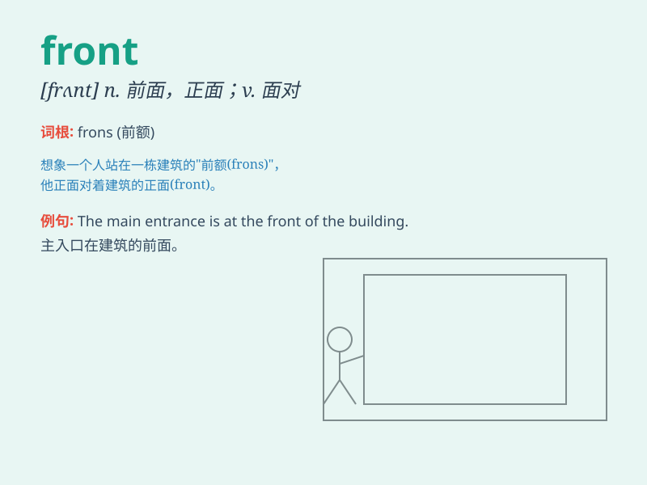

## front

**英音:** _[frʌnt]_ **美音:** _[frʌnt]_

**译义:**
*n.前面,开头,前线,(政治上的)阵线,态度,外表vt.面对,朝向,对付vi.朝向*

### 短语

+ **in front of:** _在\...\...前面_

+ **front page:** _头版；首页_

+ **front line:** _前线；第一线_

+ **front door:** _前门_

+ **front seat:** _前座_

### 例句

#### 例句1

> **The house has a beautiful front garden.**

**中文翻译:** 这座房子有一个漂亮的前花园。

**单词释义:** 前面的；前部的

#### 例句2

> **She sat in the front row at the concert.**

**中文翻译:** 她在音乐会上坐在前排。

**单词释义:** 前面；前部

#### 例句3

> **The enemy is in front of us.**

**中文翻译:** 敌人在我们前面。

**单词释义:** 在......前面

### 背诵小故事

> A brave soldier was always in the front line of the battle, facing
the enemy without fear. He protected his comrades and showed great
courage. Remember, \'front\' means the foremost part or position.

**一位勇敢的士兵总是在战斗的前线，毫不畏惧地面对敌人。他保护着战友，展现出巨大的勇气。记住，\'front\'意思是最前面的部分或位置。**

### 图义

