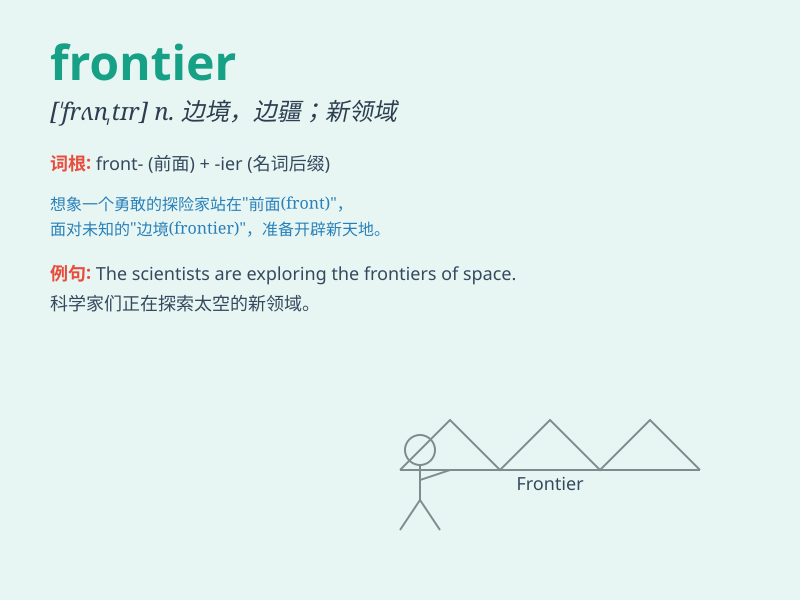

## frontier

**英音:** _[\'frʌntɪə; frʌn\'tɪə]_ **美音:**
_[frʌn\'tɪr]_

**译义:** *n.国境,边疆,边境*

### 短语

+ **frontier town:** _边陲小镇_

+ **frontier post:** _边防哨所_

+ **frontier spirit:** _开拓精神_

+ **new frontier:** _新领域_

+ **frontier area:** _边境地区_

### 例句

#### 例句1

> **The pioneers crossed the frontier to settle in the new land.**

**中文翻译:** 先驱者们跨越边境在新的土地上定居。

**单词释义:** 边境；边界

#### 例句2

> **The company is at the frontier of medical research.**

**中文翻译:** 这家公司处于医学研究的前沿。

**单词释义:** 前沿；尖端

#### 例句3

> **They explored the uncharted frontier of space.**

**中文翻译:** 他们探索了未知的太空领域。

**单词释义:** （知识等的）新领域；未开发的领域

### 背诵小故事

> A brave adventurer was determined to explore the unknown frontier. He
faced many challenges but never gave up. Finally, he discovered a new
land full of wonders. The frontier became his greatest achievement.

**一位勇敢的冒险家决心探索未知的边界。他面临许多挑战但从未放弃。最终，他发现了一片充满奇迹的新土地。边界成为了他最大的成就。**

### 图义

