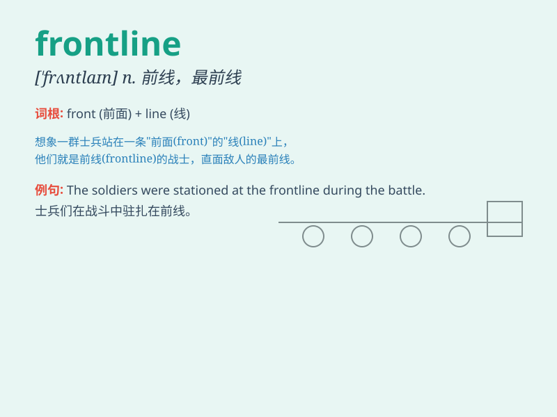

## frontline

**英音:** _[ˈfrʌntlain]_ **美音:** _[ˈfrʌntleɪn]_

**译义:** *n.前线,前沿;第一线adj.前线的,一线的*

### 短语

+ **frontline worker:** _一线工作者_

+ **frontline troops:** _前线部队_

+ **frontline position:** _前线位置_

+ **frontline service:** _一线服务_

+ **frontline defense:** _前线防御_

### 例句

#### 例句1

> **The doctors on the frontline are working tirelessly to save
lives.**

**中文翻译:** 前线的医生们正在不知疲倦地工作以拯救生命。

**单词释义:** 前线；第一线

#### 例句2

> **He was sent to the frontline of the battle.**

**中文翻译:** 他被派到战斗的前线。

**单词释义:** 前线

#### 例句3

> **The company\'s frontline staff deal with customers directly every
day.**

**中文翻译:** 公司的一线员工每天直接与客户打交道。

**单词释义:** 一线；前沿

### 背诵小故事

> In a fierce battle, the brave soldiers were on the frontline, facing
the enemy without fear. They protected their homeland with
determination. The frontline was where the most intense action took
place.

**在一场激烈的战斗中，勇敢的士兵们身处前线，毫不畏惧地面对敌人。他们坚定地保卫着自己的祖国。前线就是战斗最激烈的地方。**

### 图义

