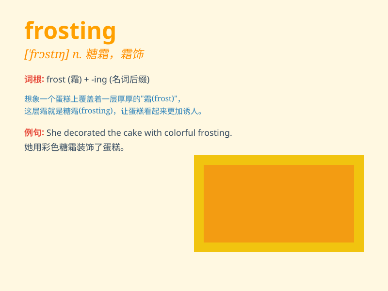

## frosting

**英音:** _[\'frɒstɪŋ]_ **美音:** _[\'frɔstɪŋ]_

**译义:** *n.霜状白糖,玻璃粉,无光泽面*

### 短语

+ **chocolate frosting:** _巧克力糖霜_

+ **vanilla frosting:** _香草糖霜_

+ **buttercream frosting:** _奶油糖霜_

+ **frosting knife:** _抹糖霜刀_

+ **make frosting:** _制作糖霜_

### 例句

#### 例句1

> **The cake was covered with delicious frosting.**

**中文翻译:** 蛋糕上覆盖着美味的糖霜。

**单词释义:** 糖霜

#### 例句2

> **She carefully spread the frosting on the cupcakes.**

**中文翻译:** 她小心翼翼地将糖霜涂在纸杯蛋糕上。

**单词释义:** 糖霜

#### 例句3

> **The frosting made the dessert look more appealing.**

**中文翻译:** 糖霜使甜点看起来更有吸引力。

**单词释义:** 糖霜

### 背诵小故事

> One cold winter morning, I opened the fridge and saw a cake covered
with white frosting. It looked like a snowy landscape. The frosting was
so sweet and smooth, making the cake a treat.

**一个寒冷的冬日早晨，我打开冰箱，看到一个覆盖着白色糖霜的蛋糕。它看起来像一片白雪皑皑的风景。糖霜又甜又滑，让这个蛋糕成为了美味的享受。**

### 图义

