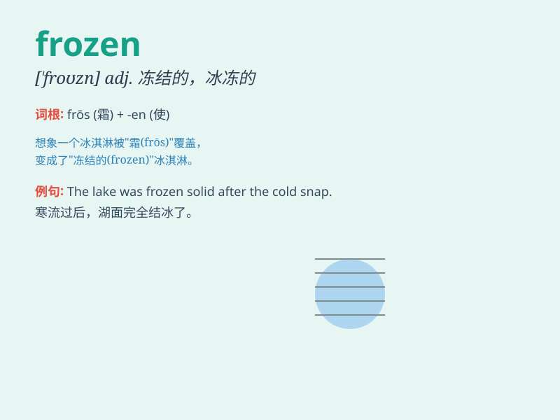

## frozen

**英音:** _[\'frəʊzn]_ **美音:** _[\'frozn]_

**译义:** *adj.冻结的,冷冰的,冷酷的 vbl.freeze的过去分词*

### 短语

+ **frozen food:** _冷冻食品_

+ **frozen yogurt:** _冻酸奶_

+ **frozen lake:** _结冰的湖_

+ **frozen assets:** _冻结资产_

+ **frozen shoulder:** _肩周炎；冻肩_

### 例句

#### 例句1

> **The lake is frozen in winter.**

**中文翻译:** 冬天湖水结冰。

**单词释义:** 结冰的；冷冻的

#### 例句2

> **She bought some frozen food from the supermarket.**

**中文翻译:** 她从超市买了一些冷冻食品。

**单词释义:** 冷冻的

#### 例句3

> **His expression remained frozen, showing no emotion.**

**中文翻译:** 他的表情依旧冰冷，看不出任何情绪。

**单词释义:** 凝固的；呆住的

### 背诵小故事

> Once upon a time, a little girl got lost in a forest during a cold
winter. Everything was frozen, including the lake and the branches. She
had to find a way home before it got darker. \'Frozen\' means something
made very hard by cold.

**从前，一个小女孩在寒冷的冬天里在森林里迷路了。一切都被冻住了，包括湖泊和树枝。她必须在天黑之前找到回家的路。\'frozen\'意思是被寒冷冻得很硬的东西。**

### 图义

