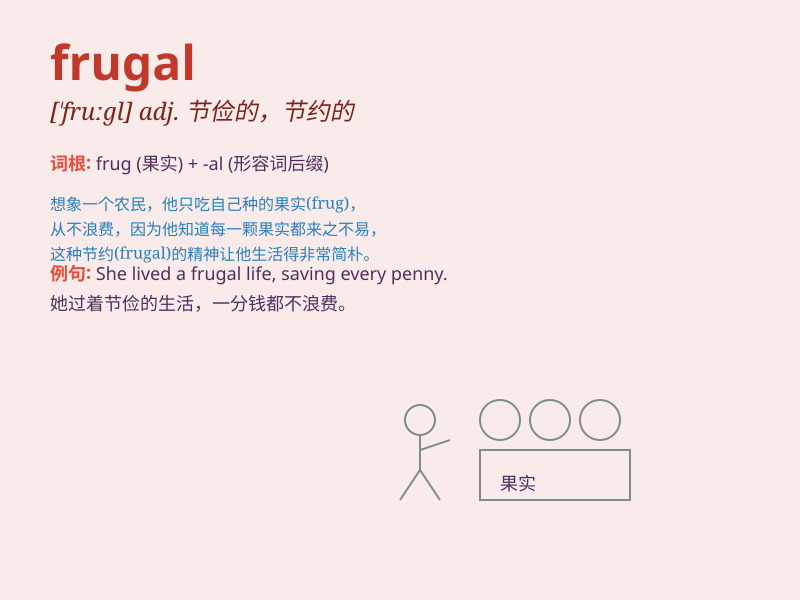

## frugal

**英音:** _[\'fruːg(ə)l]_ **美音:** _[\'fruɡl]_

**译义:** *adj.节俭的,朴素的*

### 短语

+ **frugal lifestyle:** _节俭的生活方式_

+ **frugal meal:** _简单节省的一餐_

+ **frugal spending:** _节俭的开销_

+ **be frugal with:** _在\...\...方面节俭_

+ **frugal habits:** _节俭的习惯_

### 例句

#### 例句1

> **She is very frugal and always saves money wherever possible.**

**中文翻译:** 她非常节俭，总是尽可能地省钱。

**单词释义:** 节俭的

#### 例句2

> **The frugal lifestyle allows him to accumulate a large sum of
money.**

**中文翻译:** 节俭的生活方式让他积累了一大笔钱。

**单词释义:** 节俭的

#### 例句3

> **They lead a frugal existence in the countryside.**

**中文翻译:** 他们在农村过着节俭的生活。

**单词释义:** 节俭的

### 背诵小故事

> A poor student named Lily was always very frugal. She saved money by
taking the cheapest meals and using second-hand books. Her frugality
helped her afford a trip she had dreamed of.

**一个叫莉莉的穷学生总是非常节俭。她通过吃最便宜的饭菜和使用二手书来省钱。她的节俭帮助她负担得起一次梦想中的旅行。**

### 图义

