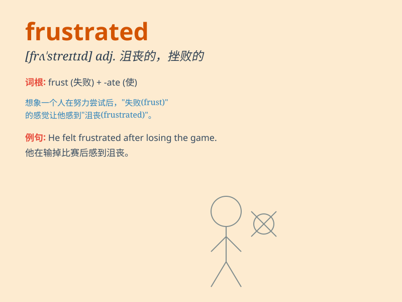

## frustrated

**英音:** _[frʌ\'streɪtɪd]_ **美音:** _[\'frʌstretɪd]_

**译义:** *adj.失败的,落空的*

### 短语

+ **feel frustrated:** _感到沮丧_

+ **frustrated attempt:** _受挫的尝试_

+ **frustrated ambition:** _受挫的雄心_

+ **frustrated expression:** _沮丧的表情_

+ **frustrated customer:** _沮丧的顾客_

### 例句

#### 例句1

> **I\'m feeling really frustrated with my job search.**

**中文翻译:** 我对找工作感到非常沮丧。

**单词释义:** 沮丧的；挫败的

#### 例句2

> **The frustrated artist threw his paintings away.**

**中文翻译:** 这位沮丧的艺术家扔掉了他的画作。

**单词释义:** 失意的；不得志的

#### 例句3

> **She was frustrated by her inability to solve the math
problem.**

**中文翻译:** 她因无法解决数学问题而感到沮丧。

**单词释义:** 懊恼的；烦恼的

### 背诵小故事

> A young artist was constantly rejected by galleries. His paintings
were ignored, and he felt frustrated. He wanted to show his talent but
faced many obstacles. Finally, he didn\'t give up and achieved success.

**一位年轻的艺术家不断被画廊拒绝。他的画作被忽视，他感到沮丧。他想展示自己的才华但面临诸多障碍。最终，他没有放弃并取得了成功。**

### 图义

