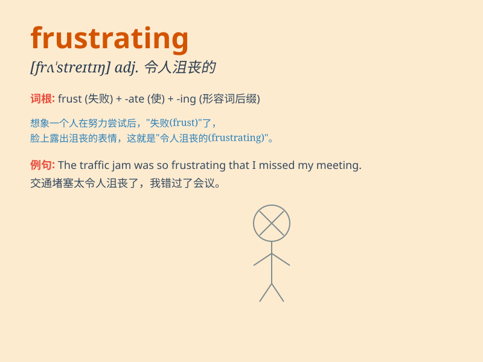

## frustrating

**英音:** _[ˈfrʌstreɪtɪŋ]_ **美音:** _[ˈfrʌstreɪtɪŋ]_

**译义:** *adj.令人沮丧的，令人懊恼的；产生挫折的*

### 短语

+ **be frustrating for:** _对\...\...来说是令人沮丧的_

+ **find something frustrating:** _发现某事令人沮丧_

+ **frustrating experience:** _令人沮丧的经历_

+ **frustrating situation:** _令人沮丧的情况_

+ **feel frustrating:** _感到沮丧_

### 例句

#### 例句1

> **Learning a new language can be frustrating at times.**

**中文翻译:** 学习一门新语言有时会令人感到沮丧。

**单词释义:** 令人沮丧的

#### 例句2

> **It\'s frustrating to be stuck in traffic for hours.**

**中文翻译:** 被困在交通堵塞中几个小时是令人懊恼的。

**单词释义:** 令人懊恼的

#### 例句3

> **Waiting for a reply can be very frustrating.**

**中文翻译:** 等待回复可能会非常令人泄气。

**单词释义:** 令人泄气的

### 背诵小故事

> I was trying to build a model airplane, but kept making mistakes. The
pieces wouldn\'t fit together. It was so frustrating. I felt like giving
up.

**我当时试图组装一架飞机模型，但一直出错。零件都拼不到一起。这太令人沮丧了。我都想放弃了。**

### 图义

