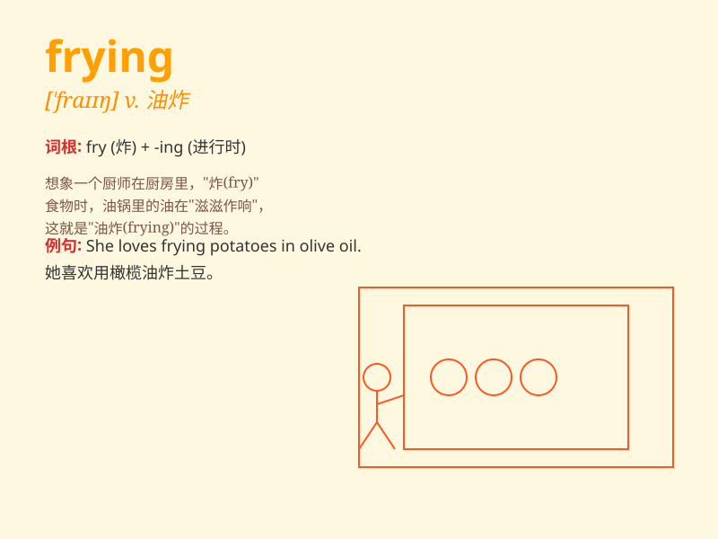

## frying

**英音:** _[ˈfraɪɪŋ]_ **美音:** _[ˈfraɪɪŋ]_

**译义:**
*n.煎炸食物；炸食；油炸食品；油炸的食物；烹调方法之一，将食物置于热油中烹调。adj.正在油炸中的；被油炸过的。*

### 短语

+ **frying pan:** _煎锅；长柄平锅_

+ **frying oil:** _煎炸油；炒菜油_

+ **deep frying:** _油炸；深度油炸_

+ **shallow frying:** _浅油炸；油煎_

+ **frying temperature:** _油炸温度_

### 例句

#### 例句1

> **I\'m frying eggs for breakfast.**

**中文翻译:** 我正在煎鸡蛋当早餐。

**单词释义:** 煎；油炸

#### 例句2

> **The chef is frying fish in the kitchen.**

**中文翻译:** 厨师正在厨房里炸鱼。

**单词释义:** 油炸

#### 例句3

> **She was frying potatoes when I arrived.**

**中文翻译:** 我到的时候她正在煎土豆。

**单词释义:** 煎

### 背诵小故事

> One day, I was very hungry. I went to the kitchen and saw my mom was
busy frying eggs. The smell was so wonderful. I couldn\'t wait to taste
them. Frying means cooking something in hot oil.

**有一天，我非常饿。我走进厨房，看到妈妈正忙着煎鸡蛋。那味道太美妙了。我迫不及待想尝尝。'frying'意思是在热油中烹饪某物。**

### 图义

