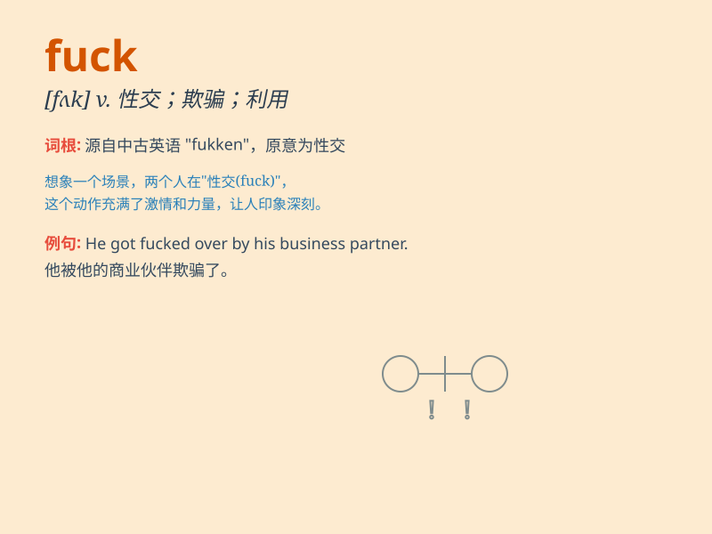

## fuck

**英音:** _[fʌk]_ **美音:** _[fʌk]_

**译义:**
*vi.性交vt.欺骗,利用,诅咒,与\...性交n.性交,杂种,性交对象,毫不在乎int.他妈的*

### 短语

+ **fuck off:** _滚开；走开_

+ **fuck up:** _搞糟；弄坏_

+ **not give a fuck:** _毫不在乎_

+ **fuck around:** _鬼混；闲荡_

+ **fuck all:** _什么都没有；毫无_

### 例句

#### 例句1

> **Oh, fuck! I forgot my keys.**

**中文翻译:** 哦，操！我忘记带钥匙了。

**单词释义:** 表示愤怒、沮丧或惊讶

#### 例句2

> **Don\'t fuck with me. I\'m not in the mood.**

**中文翻译:** 别跟我他妈的。我没心情。

**单词释义:** 挑衅、招惹

#### 例句3

> **He really fucked up this time.**

**中文翻译:** 他这次是真的完蛋了。

**单词释义:** 搞糟、弄乱

### 背诵小故事

> A man was in a bad mood. When someone accidentally bumped into him,
he shouted \'Fuck!\' to express his annoyance. It\'s a very strong and
impolite word used when one is extremely angry or frustrated.

**一个男人心情很糟。当有人不小心撞到他时，他大喊'Fuck！'来表达他的恼怒。这是一个在极其生气或沮丧时使用的非常强烈且不礼貌的词。**

### 图义

