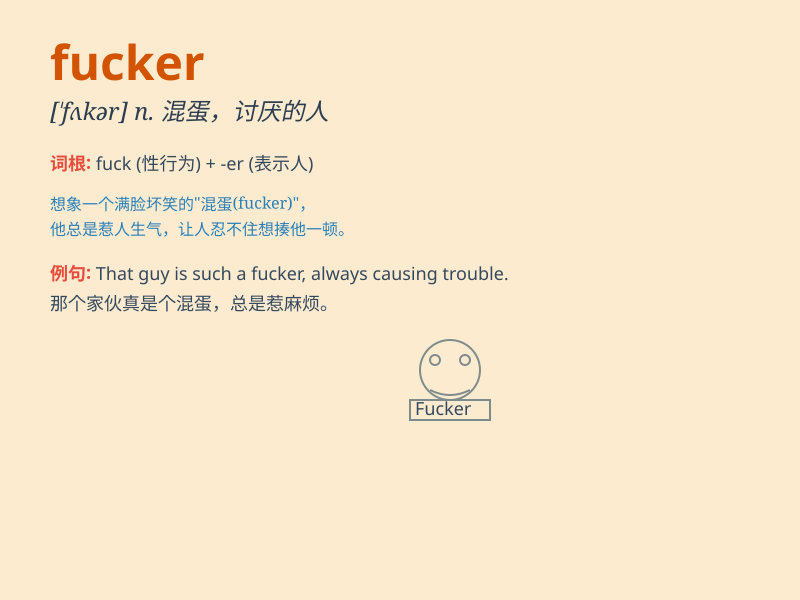

## fucker

**英音:** _[\'fʌkə(r)]_ **美音:** _[\'fʌkɚ]_

**译义:** *n.傻瓜,笨蛋*

### 短语

+ **son of a fucker:** _混蛋的儿子_

+ **stupid fucker:** _愚蠢的家伙_

+ **lousy fucker:** _讨厌的家伙_

+ **damn fucker:** _该死的家伙_

+ **crazy fucker:** _疯狂的家伙_

### 例句

#### 例句1

> **You are such a fucker!**

**中文翻译:** 你真是个混蛋！

**单词释义:** 混蛋；讨厌鬼

#### 例句2

> **Don\'t be such a fucker and do the right thing.**

**中文翻译:** 别这么混蛋，做正确的事。

**单词释义:** 混蛋；可恶的人

#### 例句3

> **I can\'t stand that fucker anymore.**

**中文翻译:** 我再也受不了那个混蛋了。

**单词释义:** 混蛋；惹人厌的人

### 背诵小故事

>
想象一个场景，有个小偷总是偷偷潜入别人家里，大家都非常生气，骂他是'fucker'，表示对他这种可恶行为的极度不满和愤怒。

**想象一个关于小偷的场景，大家用'fucker'表达对他的愤怒和不满。**

### 图义

