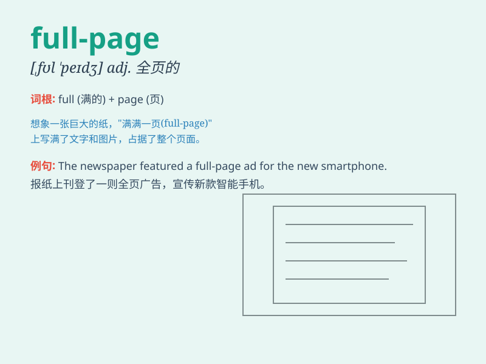

## full-page

**英音:** _[fʊl peɪdʒ]_ **美音:** _[fʊl peɪdʒ]_

**译义:** *adj. 全页的；整版的 n. 全页广告*

### 短语

+ **full-page advertisement:** _整页广告_

+ **full-page layout:** _整页排版_

+ **full-page spread:** _跨页全版_

+ **full-page feature:** _全页特写_

+ **full-page illustration:** _全页插图_

### 例句

#### 例句1

> **The newspaper featured a full-page advertisement for the new car
model.**

**中文翻译:** 这份报纸刊登了一整页关于新款汽车模型的广告。

**单词释义:** 整页的

#### 例句2

> **The magazine had a full-page interview with the famous actor.**

**中文翻译:** 这本杂志有一整页对这位著名演员的采访。

**单词释义:** 整页的

#### 例句3

> **She presented a full-page report on the project at the
meeting.**

**中文翻译:** 她在会议上展示了一份关于这个项目的整页报告。

**单词释义:** 整页的

### 背诵小故事

> A young designer was working hard on a project. He needed a full-page
illustration to make it perfect. After days of effort, he finally
created a beautiful full-page design that impressed everyone.

**一位年轻的设计师正在努力做一个项目。他需要一幅整页的插图来使其完美。经过几天的努力，他终于创作出了一幅令人印象深刻的整页设计。**

### 图义

