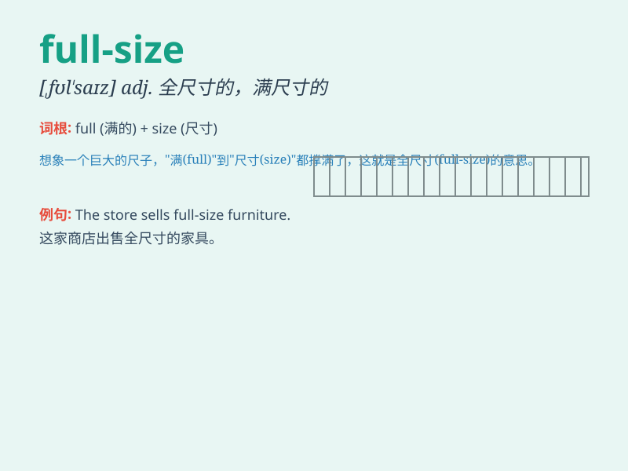

## full-size

**英音:** _[fʊlˈsaɪz]_ **美音:** _[fʊlˈsaɪz]_

**译义:**
*形容词，表示全尺寸的，标准尺寸的，指物品或设备具有完整的、未缩减的大小或规格*

### 短语

+ **full-size bed:** _标准尺寸的床_

+ **full-size car:** _大型轿车_

+ **full-size image:** _全尺寸图像_

+ **full-size keyboard:** _全尺寸键盘_

+ **full-size mirror:** _全尺寸镜子_

### 例句

#### 例句1

> **The full-size bed is very comfortable for sleeping.**

**中文翻译:** 这张大号床睡起来非常舒服。

**单词释义:** 全尺寸的，标准尺寸的

#### 例句2

> **We need a full-size car for our family trip.**

**中文翻译:** 我们家庭旅行需要一辆全尺寸的汽车。

**单词释义:** 全尺寸的，标准大小的

#### 例句3

> **The store sells full-size furniture.**

**中文翻译:** 这家商店出售全尺寸的家具。

**单词释义:** 全尺寸的，正常规格的

### 背诵小故事

> One day, I went to a furniture store. I needed a bed and was looking
for a full-size one. Finally, I found the perfect full-size bed that
could give me a comfortable sleep.

**有一天，我去了一家家具店。我需要一张床，正在寻找全尺寸的。最后，我找到了一张完美的全尺寸床，能让我睡个舒服觉。**

### 图义

