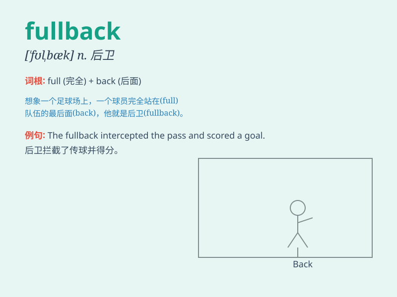

## fullback

**英音:** _[\'fʊl,bæk]_ **美音:** _[\'fʊlbæk]_

**译义:** *n.后卫*

### 短语

+ **left fullback:** _左后卫_

+ **right fullback:** _右后卫_

+ **defensive fullback:** _防守型后卫_

+ **attacking fullback:** _进攻型后卫_

+ **experienced fullback:** _经验丰富的后卫_

### 例句

#### 例句1

> **The fullback made a crucial tackle to stop the opposing team\'s
attack.**

**中文翻译:** 边后卫做出了一次关键的铲断，阻止了对方球队的进攻。

**单词释义:** （足球、橄榄球等的）后卫

#### 例句2

> **He was chosen as the fullback for the national team.**

**中文翻译:** 他被选为国家队的边后卫。

**单词释义:** （足球、橄榄球等的）后卫

#### 例句3

> **The fullback\'s performance was outstanding throughout the
season.**

**中文翻译:** 这位边后卫整个赛季的表现都很出色。

**单词释义:** （足球、橄榄球等的）后卫

### 背诵小故事

> In a football game, the fullback was like a strong wall. He was
always at the back, ready to defend and stop the opponent\'s attacks.
His position was full of responsibility and he never let the team down.

**在一场足球比赛中，后卫就像一堵坚固的墙。他总是在后方，准备防守并阻止对手的进攻。他的位置责任重大，从不让球队失望。**

### 图义

