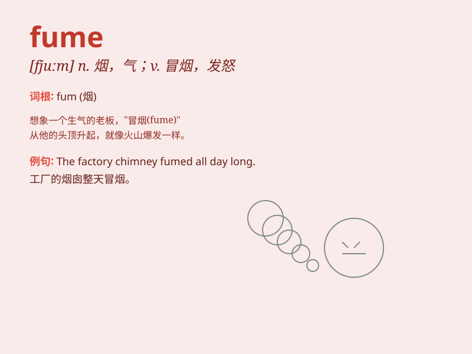

## fume

**英音:** _[fjuːm]_ **美音:** _[fjum]_

**译义:**
*n.(浓烈或难闻的)烟,气体,一阵愤怒(或不安)v.用烟熏,冒烟,发怒*

### 短语

+ **fume at:** _对\...\...生气_

+ **fume with rage:** _愤怒不已_

+ **give off fumes:** _散发烟雾_

+ **be in a fume:** _十分生气_

+ **fume over something:** _为某事生气_

### 例句

#### 例句1

> **The car\'s exhaust fumes were choking the pedestrians.**

**中文翻译:** 汽车排出的废气让行人窒息。

**单词释义:** （气体、烟雾等的）一阵

#### 例句2

> **He was fuming with rage when he heard the news.**

**中文翻译:** 当他听到这个消息时，他怒不可遏。

**单词释义:** 发怒；生气

#### 例句3

> **The chemical factory emitted toxic fumes.**

**中文翻译:** 化工厂排放有毒烟雾。

**单词释义:** 烟；烟雾

### 背诵小故事

> A factory was emitting black fumes. The villagers nearby were very
angry. They decided to protest and demand that the factory stop
polluting. So, remember \'fume\' as the bad smoke coming out of
something.

**一家工厂正在排放黑色的烟雾。附近的村民非常生气。他们决定抗议并要求工厂停止污染。所以，记住\'fume\'就是从某物中冒出来的不好的烟。**

### 图义

