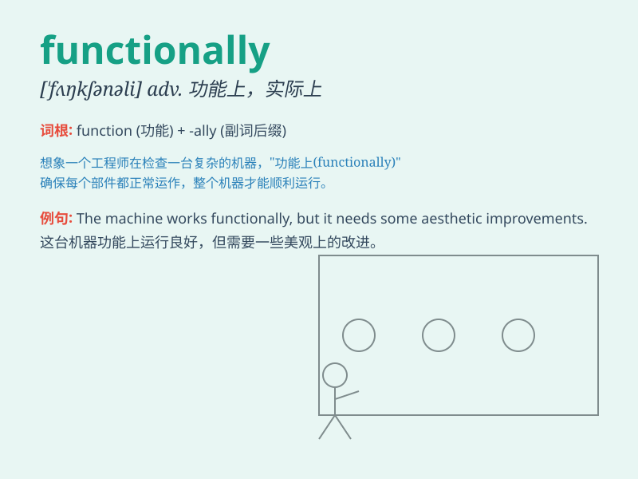

## functionally

**英音:** _[ˈfʌŋkʃənli]_ **美音:** _[ˈfʌŋkʃənəli]_

**译义:** *adv.机能上地,官能地*

### 短语

+ **functionally equivalent:** _功能上等同_

+ **functionally dependent:** _函数依赖的_

+ **functionally complete:** _功能完备的_

+ **functionally related:** _功能相关的_

+ **functionally organized:** _按功能组织的_

### 例句

#### 例句1

> **The new software is functionally superior to the old one.**

**中文翻译:** 新软件在功能上优于旧软件。

**单词释义:** 在功能方面

#### 例句2

> **The machine is functionally efficient but aesthetically
unpleasing.**

**中文翻译:** 该机器功能高效，但美观程度不高。

**单词释义:** 在功能上

#### 例句3

> **Functionally, the two systems are very similar.**

**中文翻译:** 从功能上来说，这两个系统非常相似。

**单词释义:** 从功能方面

### 背诵小故事

> A little robot was malfunctioning. But after some tweaks, it started
working functionally. It could perform tasks smoothly, just like it was
supposed to.

**一个小机器人出故障了。但经过一些调整，它开始正常运行了。它能够顺利地执行任务，就像它应该的那样。**

### 图义

