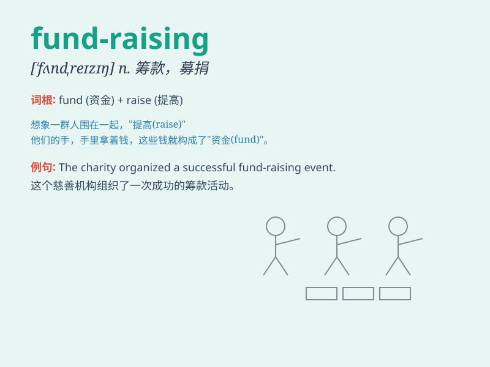

## fund-raising

**英音:** _[ˈfʌnd ˌreɪ.zɪŋ]_ **美音:** _[ˈfʌnd ˌrɛ.zɪŋ]_

**译义:** *n.募集资金，筹款活动（尤指为慈善机构募捐）*

### 短语

+ **fund-raising event:** _筹款活动_

+ **fund-raising campaign:** _筹款运动_

+ **fund-raising drive:** _筹款行动_

+ **successful fund-raising:** _成功的筹款_

+ **ongoing fund-raising:** _正在进行的筹款_

### 例句

#### 例句1

> **The school is organizing a fund-raising event to build a new
library.**

**中文翻译:** 学校正在组织一场筹款活动来建造一个新图书馆。

**单词释义:** 筹款

#### 例句2

> **The charity relies heavily on fund-raising activities to support
its cause.**

**中文翻译:** 这个慈善机构很大程度上依赖筹款活动来支持其事业。

**单词释义:** 筹款

#### 例句3

> **She is an expert in fund-raising for non-profit
organizations.**

**中文翻译:** 她是为非营利组织筹款方面的专家。

**单词释义:** 筹款

### 背诵小故事

> A group of students decided to organize a fun fair for fund-raising.
They sold homemade cookies and toys. With their efforts, they
successfully raised enough money to help build a new library for the
school.

**一群学生决定组织一场游乐会来筹款。他们出售自制的饼干和玩具。通过他们的努力，成功筹集到了足够的钱来为学校建一个新图书馆。**

### 图义

