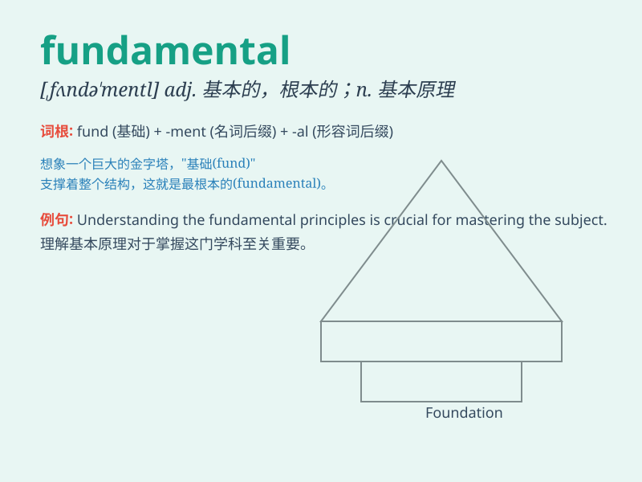

## fundamental

**英音:** _[fʌndə\'ment(ə)l]_ **美音:**
_[,fʌndə\'mɛntl]_

**译义:** *adj.基础的,基本的n.[pl.] 基本原则,基本原理*

### 短语

+ **fundamental principle:** _基本原理_

+ **fundamental change:** _根本变化_

+ **fundamental law:** _基本法_

+ **fundamental rights:** _基本权利_

+ **fundamental difference:** _根本区别_

### 例句

#### 例句1

> **The fundamental principles of justice must be upheld.**

**中文翻译:** 必须坚持正义的基本原则。

**单词释义:** 基本的

#### 例句2

> **There is a fundamental difference between these two theories.**

**中文翻译:** 这两种理论之间存在根本区别。

**单词释义:** 根本的

#### 例句3

> **A knowledge of grammar is fundamental to learning a language.**

**中文翻译:** 语法知识是学习语言的基础。

**单词释义:** 基础的

### 背诵小故事

> A young scientist was on a quest to discover a fundamental truth. He
traveled far and wide, facing many challenges. Finally, he found the key
in an ancient book, which was the fundamental knowledge he needed to
solve the mystery.

**一位年轻的科学家正在探寻一个根本的真理。他四处游历，面临诸多挑战。最终，他在一本古书中找到了关键，这就是他解开谜团所需要的根本知识。**

### 图义

