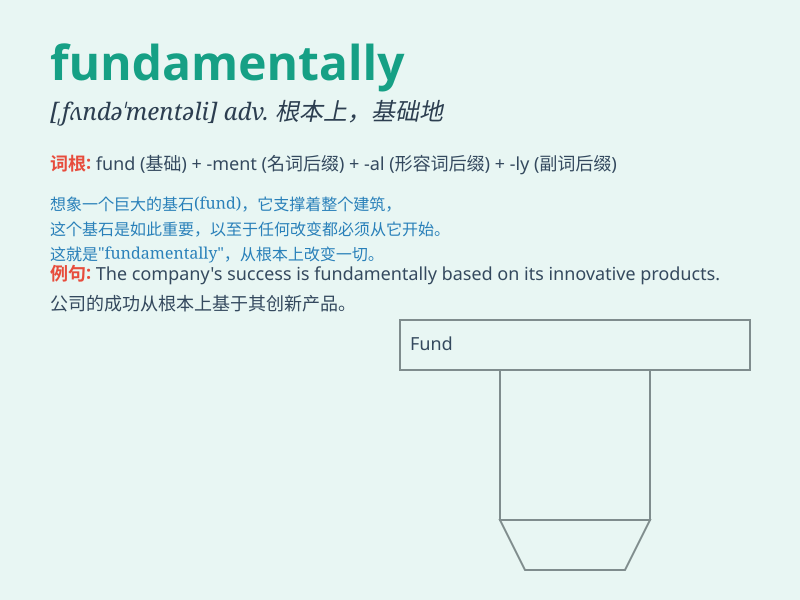

## fundamentally

**英音:** _[fʌndə\'mentəlɪ]_ **美音:**
_[,fʌndə\'mɛntəli]_

**译义:** *adv.基础地,根本地*

### 短语

+ **fundamentally different:** _根本不同_

+ **fundamentally change:** _从根本上改变_

+ **fundamentally wrong:** _根本错误_

+ **fundamentally important:** _极其重要_

+ **fundamentally flawed:** _存在根本缺陷_

### 例句

#### 例句1

> **The two approaches are fundamentally different.**

**中文翻译:** 这两种方法有根本的不同。

**单词释义:** 根本地；从根本上

#### 例句2

> **She fundamentally disagrees with his opinion.**

**中文翻译:** 她从根本上不同意他的观点。

**单词释义:** 根本地；从根本上

#### 例句3

> **This theory is fundamentally flawed.**

**中文翻译:** 这个理论从根本上来说是有缺陷的。

**单词释义:** 根本地；从根本上

### 背诵小故事

> Once upon a time, a wise architect was building a house. He said,
\'The stability of this house is fundamentally based on a strong
foundation.\' It means the house relied essentially on a solid base.

**从前，一位聪明的建筑师在建造房屋。他说：'这座房子的稳定性从根本上基于坚固的地基。'这意味着房子本质上依赖于坚实的基础。**

### 图义

