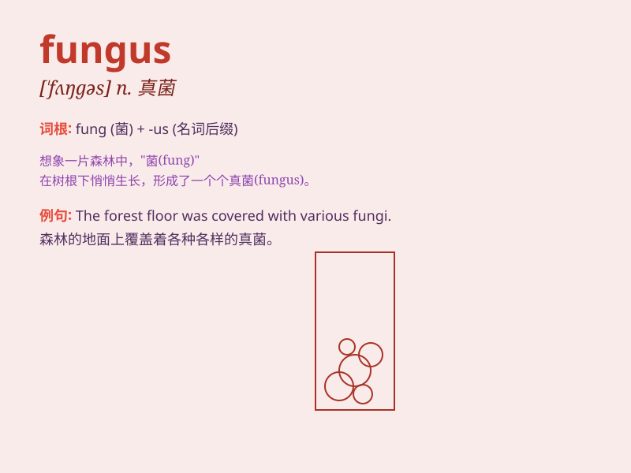

## fungus

**英音:** _[\'fʌŋgəs]_ **美音:** _[\'fʌŋɡəs]_

**译义:** *n.菌类,蘑菇*

### 短语

+ **edible fungus:** _食用菌_

+ **fungus infection:** _真菌感染_

+ **pathogenic fungus:** _病原真菌_

+ **wood-rotting fungus:** _木腐菌_

+ **marine fungus:** _海洋真菌_

### 例句

#### 例句1

> **The fungus was growing on the damp log.**

**中文翻译:** 真菌在潮湿的原木上生长。

**单词释义:** 真菌

#### 例句2

> **Some mushrooms are edible, but others are toxic fungi.**

**中文翻译:** 有些蘑菇是可以食用的，但另一些则是有毒的真菌。

**单词释义:** 真菌

#### 例句3

> **The scientist is studying the lifecycle of the fungus.**

**中文翻译:** 科学家正在研究真菌的生命周期。

**单词释义:** 真菌

### 背诵小故事

> One day, Tom was walking in the forest and saw some strange things on
the tree trunk. They looked like little umbrellas. A scientist told him
they were fungi. Tom was amazed by these special fungus.

**有一天，汤姆在森林里散步，看到树干上有一些奇怪的东西。它们看起来像小伞。一位科学家告诉他这些是真菌。汤姆对这些特别的真菌感到惊奇。**

### 图义

