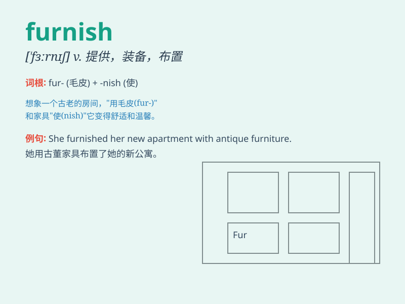

## furnish

**英音:** _[\'fɜːnɪʃ]_ **美音:** _[\'fɝnɪʃ]_

**译义:** *vt.供应,提供,装备,布置v.供给*

### 短语

+ **furnish with:** _提供；用......装备_

+ **furnish sth to sb:** _向某人提供某物_

+ **fully furnished:** _家具齐全的_

+ **furnish evidence:** _提供证据_

+ **furnish information:** _提供信息_

### 例句

#### 例句1

> **The room is furnished with a bed, a desk and a chair.**

**中文翻译:** 房间配有床、书桌和椅子。

**单词释义:** 配备；布置

#### 例句2

> **They will furnish you with all the necessary information.**

**中文翻译:** 他们将为您提供所有必要的信息。

**单词释义:** 提供

#### 例句3

> **The landlord is obliged to furnish the house before the tenants
move in.**

**中文翻译:** 房东有义务在租客搬入之前提供房屋家具。

**单词释义:** 布置；为\...配备家具

### 背诵小故事

> A poor man wanted to furnish his small house. He worked hard to earn
money and finally bought a nice sofa and a table. Now his house became
cozy. \'Furnish\' means to provide or supply what is needed for a place.

**一个穷人想要布置他的小房子。他努力工作赚钱，最终买了一个漂亮的沙发和一张桌子。现在他的房子变得舒适了。'furnish'意思是为一个地方提供或供应所需的东西。**

### 图义

