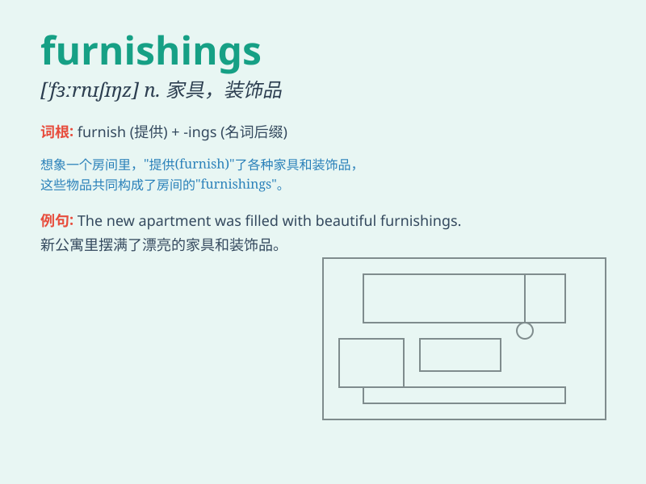

## furnishings

**英音:** _[ˈfɜːnɪʃɪŋz]_ **美音:** _[ˈfɜːrnɪʃɪŋz]_

**译义:** *n.家具,设备,服饰用品,穿戴用品,室内陈设品*

### 短语

+ **home furnishings:** _家居陈设_

+ **office furnishings:** _办公室陈设_

+ **luxurious furnishings:** _豪华的陈设_

+ **modern furnishings:** _现代的陈设_

+ **antique furnishings:** _古董陈设_

### 例句

#### 例句1

> **The room was tastefully decorated with modern furnishings.**

**中文翻译:** 房间装饰高雅，配有现代家具。

**单词释义:** 家具；室内陈设

#### 例句2

> **The old house still had some original furnishings.**

**中文翻译:** 老房子里还保留着一些原来的家具。

**单词释义:** 陈设品

#### 例句3

> **They spent a lot of money on luxurious furnishings for their new
home.**

**中文翻译:** 他们花了很多钱为新家购买豪华家具。

**单词释义:** 家具

### 背诵小故事

> One day, I moved into a new house. It was empty. But then, a truck
came with lots of furnishings like sofas, tables, and beds. These
furnishings made the house a cozy home.

**有一天，我搬进了一个新房子。它空空如也。但随后，一辆卡车运来了很多陈设，像沙发、桌子和床。这些陈设让房子变成了一个舒适的家。**

### 图义

