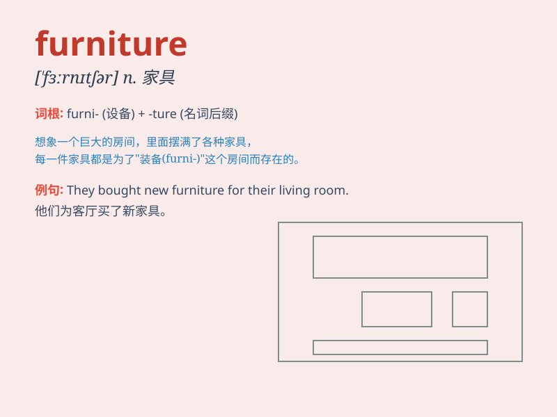

## furniture

**英音:** _[\'fɜːnɪtʃə]_ **美音:** _[\'fɝnɪtʃɚ]_

**译义:** *n.家具,设备,储藏物*

### 短语

+ **furniture store:** _家具店_

+ **wooden furniture:** _木制家具_

+ **antique furniture:** _古董家具_

+ **office furniture:** _办公家具_

+ **furniture design:** _家具设计_

### 例句

#### 例句1

> **The furniture in this room is very old-fashioned.**

**中文翻译:** 这个房间里的家具非常老式。

**单词释义:** 家具（指房间内的各类陈设）

#### 例句2

> **We need to buy some new furniture for the living room.**

**中文翻译:** 我们需要为客厅购买一些新家具。

**单词释义:** 家具（泛指需要购置的物品）

#### 例句3

> **The store sells a wide range of furniture.**

**中文翻译:** 这家商店出售各种家具。

**单词释义:** 家具（种类繁多的商品）

### 背诵小故事

> Once upon a time, a little mouse was exploring a big house. It saw
beds, chairs, and tables. All these things together were called
\'furniture\'. The mouse thought it was a wonderful word for all these
useful items in the house.

**从前，有一只小老鼠在探索一座大房子。它看到了床、椅子和桌子。所有这些东西合在一起被称为"家具"。老鼠认为对于房子里所有这些有用的物品来说，这是一个很棒的词。**

### 图义

