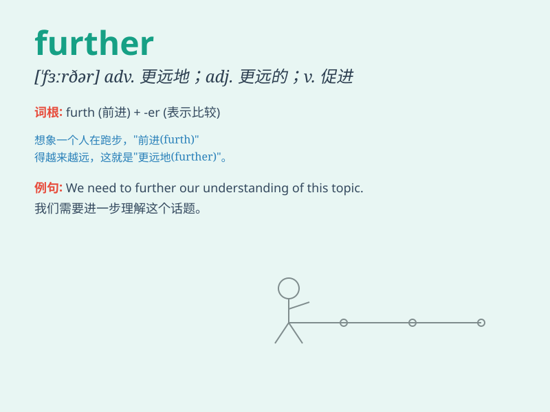

## further

**英音:** _[\'fɜːðə]_ **美音:** _[\'fɝðɚ]_

**译义:**
*adj.更远的,更多的,深一层的vt.促进,增进,助长adv.更进一步地,更远地,此外*

### 短语

+ **further education:** _继续教育；进修_

+ **further study:** _进一步研究；深造_

+ **further ahead:** _更向前；更领先_

+ **further information:** _更多信息；进一步的信息_

+ **further development:** _进一步发展；深入发展_

### 例句

#### 例句1

> **We need to further discuss this issue.**

**中文翻译:** 我们需要进一步讨论这个问题。

**单词释义:** 进一步

#### 例句2

> **This research will further our understanding of the disease.**

**中文翻译:** 这项研究将进一步加深我们对这种疾病的了解。

**单词释义:** 增进；促进

#### 例句3

> **The bad weather further complicated our journey.**

**中文翻译:** 恶劣的天气使我们的旅程变得更加复杂。

**单词释义:** 使更复杂；使更困难

### 背诵小故事

> A brave explorer was on a journey. He wanted to go further into the
unknown forest. Despite many difficulties, he kept moving forward.
Finally, he discovered a beautiful hidden lake. \'Further\' means to a
greater distance or degree.

**一位勇敢的探险家在旅行。他想更深入未知的森林。尽管困难重重，他仍不断前进。最终，他发现了一个美丽的隐藏湖泊。\'further\'意思是更远；更多；更进一步**

### 图义

