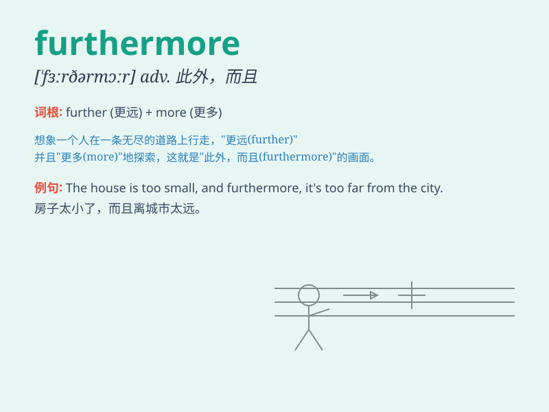

## furthermore

**英音:** _[fɜːðə\'mɔː]_ **美音:** _[,fɝðɚ\'mɔr]_

**译义:** *adv.此外,而且*

### 短语

+ **furthermore and moreover:** _而且；此外_

+ **furthermore besides:** _再者；加之_

+ **furthermore also:** _此外；也_

+ **furthermore in addition:** _另外；还有_

+ **furthermore what\'s more:** _更有甚者；更为重要的是_

### 例句

#### 例句1

> **Furthermore, the weather is expected to worsen tomorrow.**

**中文翻译:** 此外，预计明天天气会恶化。

**单词释义:** 此外；而且

#### 例句2

> **She is a talented singer. Furthermore, she is a great dancer.**

**中文翻译:** 她是一位才华横溢的歌手。此外，她还是一位出色的舞者。

**单词释义:** 而且；再者

#### 例句3

> **The project is challenging. Furthermore, we have a tight
deadline.**

**中文翻译:** 该项目具有挑战性。此外，我们的期限很紧。

**单词释义:** 此外；另外

### 背诵小故事

> A brave explorer was on a long journey. He faced many difficulties
but kept going. Furthermore, he discovered a hidden treasure that
changed his life. The word \'furthermore\' shows an addition or
continuation, like his adventure and discovery.

**一位勇敢的探险家正在长途旅行。他面临许多困难但仍继续前行。而且，他发现了一个隐藏的宝藏，改变了他的人生。单词'furthermore'表示附加或继续，就像他的冒险和发现。**

### 图义

